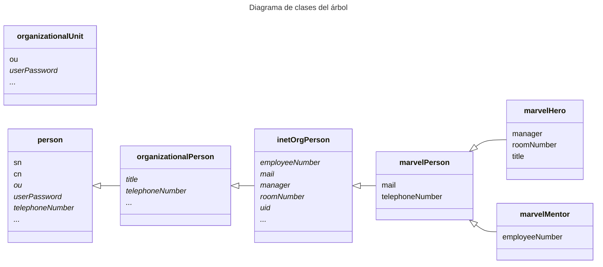
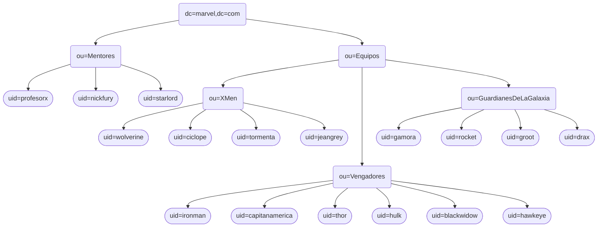

## Administración de Redes Linux <!-- omit in toc -->

# Entregable 6: LDAP II

<!-- markdownlint-disable MD053 -->
[![CC BY-SA 4.0][shield-cc-by-sa]][cc-by-sa]
[![GITT][shield-gitt]][gitt]
[![Administración de Redes Linux][shield-lna]][lna]

* [Introducción](#introducción)
* [Configuración inicial](#configuración-inicial)
* [Sistema de construcción](#sistema-de-construcción)
    * [Uso](#uso)
* [Ejercicio 1: creación del árbol](#ejercicio-1-creación-del-árbol)
    * [Definición de clases](#definición-de-clases)
    * [Definición de entradas en el árbol](#definición-de-entradas-en-el-árbol)
* [Ejercicio 2: control de acceso](#ejercicio-2-control-de-acceso)
    * [Definición de la política de acceso](#definición-de-la-política-de-acceso)
    * [Implementación de la política de acceso](#implementación-de-la-política-de-acceso)
    * [Desafíos notables](#desafíos-notables)
* [Ejercicio 3: Comprobaciones](#ejercicio-3-comprobaciones)
    * [Automatización](#automatización)
    * [Autenticación automática](#autenticación-automática)
    * [Demostración](#demostración)
* [Ejercicio 4: Mejoras](#ejercicio-4-mejoras)
    * [Schemas personalizados](#schemas-personalizados)
    * [Construcción con `make`](#construcción-con-make)
    * [Ampliación del árbol](#ampliación-del-árbol)
    * [Ampliación de los permisos](#ampliación-de-los-permisos)
* [Anexo A - Búsquedas completas](#anexo-a---búsquedas-completas)
    * [Árbol completo (búsqueda desde el administrador)](#árbol-completo-búsqueda-desde-el-administrador)
    * [Búsqueda desde Nick Fury](#búsqueda-desde-nick-fury)
    * [Búsqueda desde Drax](#búsqueda-desde-drax)

---

## Introducción

Este documento contiene el registro del desarrollo de la actividad, incluyendo
las instrucciones principales, las decisiones, y los resultados.

## Configuración inicial

Para agilizar los comandos y evitar tener que especificar el servidor y la base
(sólo para búsquedas) cada vez, se ha modificado el fichero de configuración
`/etc/ldap/ldap.conf` para incluir las siguientes líneas:

```text
BASE    dc=marvel,dc=com
URI     ldapi:///
```

## Sistema de construcción

Se ha automatizado la implementación de la actividad con el sistema de
construcción `make` mediante un [`Makefile`](Makefile).

La estructura diseñada permite ejecutar los pasos de forma independiente,
definiendo claramente las dependencias y el orden de ejecución. Además, se ha
definido de forma que se detecten los cambios en los ficheros fuente para
decidir si es necesario volver a ejecutar los pasos.

Cada sección contiene más detalles sobre el uso de `make` en su contexto.

### Uso

Con `make` o `make all` se añaden las entradas al árbol LDAP y se aplican las
políticas de acceso.

Con `make test` se ejecutan los tests disponibles (tests de permisos).

Con `make clean` se eliminan las entradas del árbol. Las entradas de
configuración de *schema* requieren operaciones complejas para su completa
eliminación, por lo que simplemente se vacían.

## Ejercicio 1: creación del árbol

### Definición de clases

Aunque no se especifica en el enunciado, para profundizar en el ejercicio se
han creado nuevas clases para los héroes y mentores de Marvel. Las nuevas
clases se han creado bajo el OID [`2.999`](https://oidref.com/2.999),
concretamente bajo el `2.999.0493990` para evitar posibles conflictos con otros
OIDs, ya que se ha considerado que este ejercicio se puede clasificar como
ejemplo de uso de OIDs.

Se han declarado como obligatorios los atributos pre-definidos que corresponden
a los datos especificados en las instrucciones. En cuanto a los datos que no
corresponden claramente a un único atributo, se ha usado el que parecía más
apropiado:

* Para el número de teléfono se ha usado `telephoneNumber` (no `mobile`).
* Para el mentor se ha usado `manager`.
* Para el nombre real/completo se ha usado `cn`

El siguiente diagrama ilustra las nuevas clases y sus atributos, así como las
clases de las que heredan.

> **Nota**: Los atributos en cursiva son opcionales. Los puntos suspensivos
> indican que la clase incluye más atributos opcionales, omitidos en el
> diagrama.



Esta extensión de clases se ha implementado usando la configuración OLC
(*on-line configuration*), usando ficheros `.ldif` en el directorio `schema/`,
afectando a la entidad `cn=marvel,cn=schema,cn=config`.

El fichero [`marvel.ldif`](schema/marvel.ldif) define la entidad.

El directorio `schema/marvel/` contiene los detalles del nuevo *schema* en
forma de modificaciones de tipo *replace*, permitiendo el reemplazo por nuevas
versiones. El fichero [`classes.ldif`](schema/marvel/classes.ldif) define las
clases.

#### Aplicación automática <!-- markdownlint-disable MD024 -->

Para aplicar todos los cambios en los *schemas* existe un *target* en el
[`Makefile`](Makefile):

```sh
make schema
```

Este *target* automatiza la aplicación manual descrita en la sección siguiente,
con la diferencia de que mantiene un pequeño registro de los cambios aplicados
y la fecha de última actualización para evitar repetir las operaciones si no es
necesario.

#### Aplicación manual <!-- markdownlint-disable MD024 -->

Para crear la entidad principal se utiliza el comando `ldapadd`:

```sh
sudo ldapadd -WY EXTERNAL -f schema/marvel.ldif
```

Para añadir las clases se utiliza el comando `ldapmodify`:

```sh
sudo ldapmodify -WY EXTERNAL -f schema/marvel/classes.ldif
```

### Definición de entradas en el árbol

Usando un solo fichero, [`entries/base.ldif`](entries/base.ldif), se ha creado
el siguiente árbol LDAP:



#### Unidades organizativas

Las unidades organizativas (en rectángulos redondeados) se han definido usando
la clase `organizationalUnit`, que hereda de `top` implícitamente. A
continuación se muestra un ejemplo de definición de una unidad organizativa:

```ldif
dn: ou=Mentores,dc=marvel,dc=com
objectClass: organizationalUnit
ou: Mentores
```

#### Héroes y mentores

Para usar las clases personalizadas en las entradas correspondientes a personas
(en estadios/discorectángulos) se ha especificado la clase relevante como
`objectClass`. Se ha incluido explícitamente la clase `inetOrgPerson` para
mayor claridad, aunque no sea técnicamente necesaria.

El fichero `entries/base.ldif` está codificado en UTF-8. Las tildes y
caracteres no-ASCII en los campos se han dejado tal cual, y son codificados
automáticamente por `ldapadd`.

A continuación se muestra un ejemplo de definición de un héroe:

```ldif
dn: uid=rocket,ou=GuardianesDeLaGalaxia,ou=Equipos,dc=marvel,dc=com
objectClass: inetOrgPerson
objectClass: marvelHero
uid: rocket
cn: Rocket Raccoon
sn: Raccoon
mail: rocket@guardianes.marvel.com
telephoneNumber: +1-555-89P13
manager: uid=starlord,ou=Mentores,dc=marvel,dc=com
roomNumber: 302
title: Guardián del Cuadrante Keystone
```

El siguiente es un ejemplo de definición de un mentor:

```ldif
dn: uid=starlord,ou=Mentores,dc=marvel,dc=com
objectClass: inetOrgPerson
objectClass: marvelMentor
uid: starlord
cn: Peter Quill
sn: Quill
mail: starlord@mentores.marvel.com
telephoneNumber: +1-555-1976
employeeNumber: 0003
```

#### Aplicación automática <!-- markdownlint-disable-line MD024 -->

Para añadir todas las entradas al árbol existe un *target* en el
[`Makefile`](Makefile):

```sh
make base
```

Este *target* automatiza la aplicación manual descrita en la sección siguiente
y la registra en el sistema de construcción.

#### Aplicación manual <!-- markdownlint-disable-line MD024 -->

Para añadir entradas al árbol LDAP se usa el comando `ldapadd`:

```sh
ldapadd -xWD 'cn=admin,dc=marvel,dc=com' -f entries/base.ldif
```

## Ejercicio 2: control de acceso

### Definición de la política de acceso

El control de acceso en LDAP sigue un orden de comprobación muy estricto.
Siguiendo el orden de las entradas en la configuración:

* Se selecciona la primera entrada en la que coincida el `<what>` con el
  atributo que se intenta acceder
* Se selecciona la primera entrada en la que coincida el `<who>` con el
  usuario que intenta acceder

Ya que esto no permite *fallbacks*, se ha creado una tabla con todas las
combinaciones de acceso y usuarios. Cada fila corresponde a un `<what>`,
mientras que cada columna corresponde a un `who`. Ha de tenerse en cuenta que
el acceso para el administrador está implícito, y no es necesario incluirlo en
la configuración, aunque se hará.

La tabla está ordenada verticalmente con prioridad descendente, que en este
caso coincide con el orden de las entradas en la configuración. Al no haber
solapamiento entre distintas filas (excepto la última), un cambio de orden no
afectaría la funcionalidad.

El orden horizontal no coincide con el de la configuración, sino que se ha
decidido de forma que la información sea más clara y fácil de entender. Las
entradas con '-' indican que no se ha definido acceso, pero no indica que se
le niegue explícitamente. Si hubiera otra columna que aplicara al usuario,
se aplicaría la regla de la columna correspondiente. Si ninguna columna
le concediera acceso, se le denegaría.

<!-- markdownlint-capture -->
<!-- markdownlint-disable MD013 -->
| What \ Who                          | admin | self | anon | Mentores | Prof. X | Nick Fury | Starlord | Héroes | Héroes del equipo | Héroes mentorizados   |
| ----------                          | ----- | ---- | ---- | -------- | ------- | --------- | -------- | ------ | ----------------- | --------------------- |
| `userPassword`                      | W     | W    | Auth | -        | -       | -         | -        | -      | -                 | -                     |
| `Vengadores`: `roomNumber`          | W     | R    | -    | R        | W       | W         | -        | -      | -                 | -                     |
| `Guardianes`: `title`               | W     | R    | -    | R        | W       | -         | W        | -      | -                 | -                     |
| `Mentores`: `mail`                  | W     | R    | -    | R        | W       | -         | -        | R      | -                 | -                     |
| `Héroes`: `mail`, `telephoneNumber` | W     | R    | -    | R        | W       | -         | -        | R      | -                 | -                     |
| `Héroes`: `cn`                      | W     | R    | -    | R        | W       | -         | -        | -      | R                 | -                     |
| `Mentores`: `cn`                    | W     | R    | -    | R        | W       | -         | -        | -      | -                 | R                     |
| `*`                                 | W     | R    | -    | R        | W       | -         | -        | -      | -                 | -                     |
<!-- markdownlint-restore -->

### Implementación de la política de acceso

La política de acceso se ha definido en el fichero
[`updates/permissions.ldif`](updates/permissions.ldif), que contiene las
instrucciones para actualizar la configuración de acceso.

Se ha seguido la sintaxis de configuración de acceso descrita en el manual de
[OpenLDAP v2.5][openldap-v2.5-AC] (versión instalada en la máquina virtual) y
en la página del manual `slapd.access(5)`.

Para traducir la tabla en entradas de configuración de acceso, primero se ha
definido la regla menos específica. A continuación se han añadido las reglas
más específicas, incluyendo las especificaciones de la regla genérica cuando la
estas se solapan.

Esta política de acceso se ha aplicado modificando la entrada de configuración
`olcDatabase={1}mdb,cn=config` mediante el comando `ldapmodify`. El archivo
`permissions.ldif` contiene las instrucciones para modificar la configuración,
con `changetype: modify` y `replace: olcAccess` para asegurar que los permisos
en la configuración coinciden exactamente con los descritos en el archivo. Las
entradas de control de acceso se han añadido como adiciones al atributo
`olcAccess`, reemplazando a todas las anteriores y preservando el orden
necesario.

#### Aplicación automática <!-- markdownlint-disable-line MD024 -->

Para aplicar al servidor la configuración definida existe un *target* en el
[`Makefile`](Makefile):

```sh
make permissions
```

Este *target* automatiza la aplicación manual descrita en la sección siguiente
y registra este hecho, así como la fecha de última actualización, para poder
evitar repetir las operaciones cuando se requiera el *target* pero esté ya
aplicada la configuración más reciente. Además, depende de `base`, por lo que
se asegura de que el árbol LDAP está creado antes de aplicar la configuración.

#### Aplicación manual <!-- markdownlint-disable-line MD024 -->

Para actualizar la configuración se usa el comando `ldapmodify`:

```sh
sudo ldapmodify -WY EXTERNAL -f updates/permissions.ldif
```

### Desafíos notables

#### Acceso de `entry`

Aunque un usuario tenga acceso a un atributo, puede no tener acceso al
pseudoatributo `entry` del objeto, por lo que será incapaz de acceder al
atributo en cuestión. Para ello, se ha añadido una regla para permitir el
acceso a este pseudoatributo en todas las entradas de clase `marvelPerson`
desde los usuarios de clase `marvelHero` y `marvelMentor`. Se ha decidido así
para seguir el principio de menor privilegio, y no se han juntado los `by`
para hacerlo más claro y editable.

#### Acceso de un héroe a su equipo

Para permitir el acceso entre héroes del mismo equipo se ha usado `to
dn.regex="ou=[^,]+,ou=Equipos,dc=marvel,dc=com$"` junto con `by
dn.subtree,expand="$0"`, donde `$0` se expande a la parte del DN de la entrada
a la que se está intentando acceder que coincida con la expresión regular. La
expresión regular recoge el equipo al que pertenece la entrada a la que se
quiere acceder, mientras que el selector de *who* permite el acceso a los
héroes del mismo equipo.

#### Acceso de un héroe a su mentor

Para permitir el acceso de los héroes a los mentores especificados en su campo
`manager`, se ha utilizado el selector `by set="user/manager & this"`, donde
`this` se refiere al mentor al que se intenta acceder, y `user/manager` permite
la comparación de la entrada accedida con el campo `manager` del usuario que
está intentando acceder

## Ejercicio 3: Comprobaciones

### Automatización

Las comprobaciones más relevantes son las de acceso. Se han desarrollado tests
en forma de scripts de Bash y se han usado continuamente siguiendo el enfoque
de *test-driven development* (TDD) y de desarrollo incremental.

Los tests están diseñados siguiendo la tabla del apartado anterior, comprobando
para cada usuario el acceso a los distintos atributos. Concretamente, los
permisos comprobados son los siguientes, confiando en que sean suficientes para
cubrir todos los casos:

<!-- markdownlint-capture -->
<!-- markdownlint-disable MD013 -->
|                    | Usuario cualquiera (Cíclope): `userPassword` | Héroe de los Vengadores (Hawkeye): `roomNumber`  | Héroe de los Guardianes (Drax): `title` | Mentor (Starlord): `mail`  | Héroe (Drax): `telephoneNumber` |
| ----------         | -------------------------------------------- | ------------------------------------------------ | -------------------------------------   | -------------------------- | ------------------------------- |
| [Self]             | `W`                                          | `R-`                                             | `R-`                                    | `R-`                       | `R-`                            |
| Admin              | `W`                                          | `W`                                              | `W`                                     | `W`                        | `W`                             |
| Mentor (Nick Fury) | `-`                                          | `R`                                              | `R`                                     | `R-`                       | `R-`                            |
| Mentor (Starlord)  | `-`                                          | `R`                                              | `R`                                     | `R-`                       | `R-`                            |
| Profesor X         | `-`                                          | `W`                                              | `W`                                     | `W`                        | `W`                             |
|                    |                                              |                                                  |                                         |                            |                                 |
| Nick Fury          | `-`                                          | `W`                                              | `R-`                                    |                            |                                 |
| Starlord           | `-`                                          | `R-`                                             | `W`                                     |                            |                                 |
| Héroe (Wolverine)  | `-`                                          | `-`                                              | `-`                                     | `R-`                       | `R-`                            |
| Héroe (Ironman)    | `-`                                          | `-`                                              | `-`                                     | `R-`                       | `R-`                            |
| Héroe (Groot)      | `-`                                          | `-`                                              | `-`                                     | `R-`                       | `R-`                            |

<span></span>

|                                   | Héroe de los X-Men (Cíclope): `cn` | Héroe de los Vengadores (Hawkeye): `cn` | Héroe de los Guardianes (Drax): `cn` | Mentor de los X-Men (Profesor X): `cn` | Mentor de los Vengadores (Nick Fury): `cn` | Mentor de los Guardianes (Starlord): `cn` |
| ----------                        | ---------------------------------- | --------------------------------------- | ------------------------------------ | -------------------------------------- | ------------------------------------------ | ----------------------------------------- |
| [Self]                            | `R-`                               | `R-`                                    | `R-`                                 | `R-`                                   | `R-`                                       | `R-`                                      |
| Admin                             | `W`                                | `W`                                     | `W`                                  | `W`                                    | `W`                                        | `W`                                       |
| Mentor (Nick Fury)                | `R-`                               | `R-`                                    | `R-`                                 | `R-`                                   | `R-`                                       | `R-`                                      |
| Mentor (Starlord)                 | `R-`                               | `R-`                                    | `R-`                                 | `R-`                                   | `R-`                                       | `R-`                                      |
| Profesor X                        | `W`                                | `W`                                     | `W`                                  | `W`                                    | `W`                                        | `W`                                       |
|                                   |                                    |                                         |                                      |                                        |                                            |                                           |
| Héroe de los X-Men (Wolverine)    | `R`                                | `-`                                     | `-`                                  | `R`                                    | `-`                                        | `-`                                       |
| Héroe de los Vengadores (Ironman) | `-`                                | `R`                                     | `-`                                  | `-`                                    | `R`                                        | `-`                                       |
| Héroe de los Guardianes (Groot)   | `-`                                | `-`                                     | `R`                                  | `-`                                    | `-`                                        | `R`                                       |
<!-- markdownlint-restore -->

En las tablas anteriores, cada fila es un conjunto de tests. Se comprueba que
el usuario que encabeza la fila tiene el acceso correspondiente para la entrada
especificada en la columna: `R` para lectura (al menos), `R-` para lectura
exclusiva, `W` para escritura, `-` para denegado.

En las cabezas de fila y columna se describe el grupo de entradas que se
pretende probar, seguido del ejemplar entre paréntesis y el atributo concreto a
continuación. Por ejemplo, `Mentor (Starlord): mail` indica que se pretende
probar el acceso al atributo `mail` de un mentor, y se ha usado Starlord para
la prueba.

El principal ejecutable para estos tests es
[`test/test-permissions.sh`](test/test-permissions.sh). Este script ejecuta
todos los tests definidos, dando información sobre el resultado de cada uno.

#### Integración con `make` <!-- markdownlint-disable-line MD024 -->

Para ejecutar los tests de permisos, se ha definido un *target* en el
[`Makefile`](Makefile), incluido en el *target* `test`:

```sh
make test-permissions
```

Este *target* depende de `permissions` y de `passwords` (definido en la sección
siguiente), por lo que se asegura de que la configuración de acceso y las
contraseñas están actualizadas antes de ejecutar los tests. Requiere que las
contraseñas de los usuarios estén definidas en el directorio `test/passwords`.

### Autenticación automática

Los tests de permisos dependen de la autenticación como varios usuarios. Para
obtener las contraseñas de forma automática, el script busca un fichero cuyo
nombre coincida con el usuario que se está autenticando en el directorio
especificado por la opción `-p` o `--passwords` del script (`./passwords` por
defecto). Este fichero debe contener únicamente la contraseña del usuario,
**sin nueva línea adicional al final**[^1]. Los ficheros de contraseñas
requeridos para los tests, a excepción del del administrador, se han incluido
en el directorio [`test/passwords`](test/passwords).

Para evitar inconsistencias, se ha creado un script de Bash
[`test/set-passwords.sh`](test/set-passwords.sh) que establece las
contraseñas de los usuarios si encuentra un fichero con su nombre en el
directorio definido por la opción `-p` o `--passwords` (`./passwords` por
defecto). Este script depende de la existencia del directorio y de un fichero
con la contraseña del usuario `cn=admin,dc=marvel,dc=com`, que se usa para
autenticarse como administrador y poder cambiar las contraseñas con permisos
elevados. **Este fichero no se incluye en el repositorio**

[^1]: Para crear un archivo sin saltos de línea al final, se pueden usar
    comandos como `echo -n` o `printf`, o bien usar un editor de texto que
    permita guardar el archivo sin saltos de línea. En Vim, esto se puede
    conseguir usando `:set nofixeol | set noeol`.

#### Integración con `make` <!-- markdownlint-disable-line MD024 -->

Para gestionar mejor el proceso de establecimiento de contraseñas, se ha
definido un *target* en el [`Makefile`](Makefile):

```sh
make passwords
```

Este *target* depende de `base`, por lo que se asegura de que el árbol LDAP
está creado antes de establecer las contraseñas. Obtiene las contraseñas del
directorio `test/passwords`, comprobando si se han cambiado desde la última
aplicación.

### Demostración

Para demostrar el funcionamiento de las políticas de acceso, a continuación se
muestran algunos ejemplos de acceso mediante `ldapsearch`. La salida de los
comandos se ha reducido a las partes más significativas.

#### Búsqueda anónima

Los usuarios anónimos no tienen acceso de lectura a nada, pero pueden usar el
atributo `userPassword` para autenticarse.

| [logs/3-search-anon.log](logs/3-search-anon.log) |
| -------------------------------------------------- |
<!-- File extract -->
```text
$ ldapsearch -xD ''
# extended LDIF
#
# LDAPv3
# base <dc=marvel,dc=com> (default) with scope subtree
# filter: (objectclass=*)
# requesting: ALL
#

# search result
search: 2
result: 32 No such object

# numResponses: 1
```

#### Lectura a uno mismo

Cualquier usuario puede leer todos sus atributos. Además, pueden cambiar su
contraseña (no se puede comprobar con `ldapsearch`, pero sí con `ldapmodify`,
como hacen los tests automáticos).

| [logs/3-search-self.log](logs/3-search-self.log) |
| ------------------------------------------------ |
<!-- File extract -->
```text
$ ldapsearch -xWD 'uid=wolverine,ou=XMen,ou=Equipos,dc=marvel,dc=com' -b 'uid=wolverine,ou=XMen,ou=Equipos,dc=marvel,dc=com'
[...]

# wolverine, XMen, Equipos, marvel.com
dn: uid=wolverine,ou=XMen,ou=Equipos,dc=marvel,dc=com
objectClass: inetOrgPerson
objectClass: marvelHero
uid: wolverine
cn: James "Logan" Howlett
sn: Howlett
mail: wolverine@xmen.marvel.com
telephoneNumber: +1-555-1001
manager: uid=profesorx,ou=Mentores,dc=marvel,dc=com
roomNumber: 101
title: Arma X
userPassword:: e1NTSEF9UWhrbXVvOUVsczNYcFBZT0pmQVhSQXRueHRIK1p3SU0=

[...]
```

#### Búsqueda desde un mentor

Los mentores tienen acceso de lectura a todo (excepto contraseñas)

| [logs/3-search-mentor.log](logs/3-search-mentor.log) |
| ---------------------------------------------------- |
<!-- File extract -->
```text
$ ldapsearch -xWD 'uid=starlord,ou=Mentores,dc=marvel,dc=com'
[...]

# profesorx, Mentores, marvel.com
dn: uid=profesorx,ou=Mentores,dc=marvel,dc=com
objectClass: inetOrgPerson
objectClass: marvelMentor
uid: profesorx
sn: Xavier
mail: profesorx@mentores.marvel.com
telephoneNumber: +1-555-0001
employeeNumber: 0001
cn: Charles Xavier

# nickfury, Mentores, marvel.com
dn: uid=nickfury,ou=Mentores,dc=marvel,dc=com
objectClass: inetOrgPerson
objectClass: marvelMentor
uid: nickfury
sn: Fury
mail: nickfury@mentores.marvel.com
telephoneNumber: +1-555-1963
employeeNumber: 0002
cn: Nick Fury

# starlord, Mentores, marvel.com
dn: uid=starlord,ou=Mentores,dc=marvel,dc=com
objectClass: inetOrgPerson
objectClass: marvelMentor
uid: starlord
sn: Quill
telephoneNumber: +1-555-1976
employeeNumber: 0003
userPassword:: e1NTSEF9U3dKNFdBWFR1UHBESjRHZzVhMW12UWV5b29ZWGM2UFI=
mail: starlord@mentores.marvel.com
cn: Peter Quill

# wolverine, XMen, Equipos, marvel.com
dn: uid=wolverine,ou=XMen,ou=Equipos,dc=marvel,dc=com
objectClass: inetOrgPerson
objectClass: marvelHero
uid: wolverine
cn: James "Logan" Howlett
sn: Howlett
mail: wolverine@xmen.marvel.com
telephoneNumber: +1-555-1001
manager: uid=profesorx,ou=Mentores,dc=marvel,dc=com
roomNumber: 101
title: Arma X

[...]
```

#### Búsqueda desde un héroe

Los héroes tienen acceso de lectura al `mail` de todos los mentores y al `mail`
y `telephoneNumber` de todos los héroes. Además, pueden leer el `cn` de los
héroes de su propio equipo y de su mentor.

| [logs/3-search-hero.log](logs/3-search-hero.log) |
| ------------------------------------------------ |
<!-- File extract -->
```text
$ ldapsearch -xWD 'uid=wolverine,ou=XMen,ou=Equipos,dc=marvel,dc=com'
[...]

# profesorx, Mentores, marvel.com
dn: uid=profesorx,ou=Mentores,dc=marvel,dc=com
mail: profesorx@mentores.marvel.com
cn: Charles Xavier

# nickfury, Mentores, marvel.com
dn: uid=nickfury,ou=Mentores,dc=marvel,dc=com
mail: nickfury@mentores.marvel.com

# starlord, Mentores, marvel.com
dn: uid=starlord,ou=Mentores,dc=marvel,dc=com
mail: starlord@mentores.marvel.com

# wolverine, XMen, Equipos, marvel.com
dn: uid=wolverine,ou=XMen,ou=Equipos,dc=marvel,dc=com
objectClass: inetOrgPerson
objectClass: marvelHero
uid: wolverine
cn: James "Logan" Howlett
sn: Howlett
mail: wolverine@xmen.marvel.com
telephoneNumber: +1-555-1001
manager: uid=profesorx,ou=Mentores,dc=marvel,dc=com
roomNumber: 101
title: Arma X
userPassword:: e1NTSEF9UWhrbXVvOUVsczNYcFBZT0pmQVhSQXRueHRIK1p3SU0=

# ciclope, XMen, Equipos, marvel.com
dn: uid=ciclope,ou=XMen,ou=Equipos,dc=marvel,dc=com
mail: ciclope@xmen.marvel.com
telephoneNumber: +1-555-1002
cn: Scott Summers

# tormenta, XMen, Equipos, marvel.com
dn: uid=tormenta,ou=XMen,ou=Equipos,dc=marvel,dc=com
cn: Ororo Munroe
mail: tormenta@xmen.marvel.com
telephoneNumber: +1-555-1003

# jeangrey, XMen, Equipos, marvel.com
dn: uid=jeangrey,ou=XMen,ou=Equipos,dc=marvel,dc=com
cn: Jean Elaine Grey-Summers
mail: jeangrey@xmen.marvel.com
telephoneNumber: +1-555-1004

# ironman, Vengadores, Equipos, marvel.com
dn: uid=ironman,ou=Vengadores,ou=Equipos,dc=marvel,dc=com
mail: ironman@vengadores.marvel.com
telephoneNumber: +1-555-3000

[...]
```

## Ejercicio 4: Mejoras

Además de las ampliaciones propuestas en el enunciado, que son continuaciones
de los ejercicios anteriores, se han incluido varias mejoras que afectan al
sistema entero.

### Schemas personalizados

Aunque no se requiere en el enunciado, las especificaciones de los distintos
tipos de entradas encajan bien con el uso de *schemas* personalizados. Con este
enfoque, las especificaciones se imponen estrictamente, además de facilitar la
lectura y la interpretación de los datos. Estos *schemas* están detallados en
las secciones correspondientes:

* Los *schemas* relacionados con los requerimientos del ejercicio 1 están en el
  apartado [Definición de clases](#definición-de-clases)
* Los *schemas* añadidos como mejoras al realizar el ejercicio 4 están en los
  apartados [Nuevos atributos](#nuevos-atributos) y [Nuevas
  clases](#nuevas-clases)

### Construcción con `make`

Durante el desarrollo del control de acceso, se empezó a usar `make` para
automatizar la aplicación de los cambios y los tests, incluyendo varios
*targets*:

* `base`: La población del árbol LDAP.
* `permissions`: La aplicación de la configuración de acceso.
* `passwords`: El establecimiento de las contraseñas definidas
* `test` y `test-permissions`: La ejecución de los tests.
* `clean`: El borrado de entradas del árbol LDAP.

Más adelante se integró la aplicación de los *schemas* en el sistema, con
capacidad de ampliación, bajo el *target* `schema`.

El uso de `make` aplicado a cada sección está documentado brevemente en la
sección correspondiente.

#### Detalles técnicos

El `Makefile` está diseñado de tal manera que se registren los cambios
aplicados mediante archivos vacíos en el directorio `build`, que funcionan como
marcadores para detectar si hay cambios en los archivos fuente que haya que
aplicar.

Además, hay implementado un sistema que guarda la contraseña del administrador
una sola vez en un archivo temporal seguro (pero no encriptado) y la reutiliza
para todas las operaciones en una misma llamada a `make`, eliminando el archivo
al terminar o si hay un error o interrupción.

### Ampliación del árbol

Para dar variedad al ejercicio más allá de añadir entradas o datos adicionales,
se ha ampliado la información requerida por las especificaciones con
**atributos personalizados** de distintos tipos.

Estos atributos se han añadido al *schema* introducido anteriormente añadiendo
`olcAttributeTypes` a la entrada de configuración correspondiente. Están
definidos en el archivo
[`schema/marvel/attributes.ldif`](schema/marvel/attributes.ldif), y su
aplicación está integrada en el *target* `schema` del `Makefile`.

#### Nuevos atributos

Los atributos definidos son los siguientes

* `species` (Texto) \
  Ya que los personajes de Marvel no son todos humanos, se usará este atributo
  para describir su especie.

* `snapped` (Booleano: `TRUE` | `FALSE`) \
  Este atributo contiene `TRUE` si el personaje fue víctima del chasquido de
  Thanos (Avengers: Infinity War). Se aplica a muchos personajes, pero no a
  todos

* `quote` (Texto) \
  Este atributo está pensado para guardar frases y citas memorables de un
  personaje. Puede aparecer varias veces.

* `firstAppearance` (Formato de Tiempo Generalizado:
  `<YYYY><MM><DD><HH>[mm][ss][.fff]<Z>`) \
  Este atributo servirá para almacenar la fecha de primera aparición de un
  personaje (primer cómic o película en la que salió)

* `comic`, `inComic`, `movie`, `inMovie` (Texto) \
  `comic` y `movie` son simplemente títulos de una película, sin más
  implicaciones, mientras que `inComic` e `inMovie` implican que el personaje
  al que corresponde la entrada LDAP apareció en el cómic o en la película
  indicada. Lo normal es que estos atributos tengan varios valores, pero no
  necesariamente son una lista exhaustiva de todas las apariciones de un
  personaje (de hecho, debido a la gran cantidad de material, normalmente
  contendrán solo algunos valores importantes)

#### Nuevas clases

Para que las entradas del árbol puedan tener estos atributos, se han creado
nuevas clases y se han ampliado algunas ya existentes.

Se ha actualizado la clase `marvelPerson` para requerir la especie (`species`)
del personaje en cuestión, además de aceptar opcionalmente los atributos
`snapped` y `quote`.

Se han creado nuevas clases de tipo **auxiliar**. Esto es necesario para que
puedan coexistir sin problemas con el resto de clases, que son
**estructurales**.

* `marvelCharacter` amplía un personaje de Marvel. La diferencia con
  `marvelPerson` es que esta clase se centra en *metadatos*, o datos sobre el
  personaje visto desde el mundo real. Como atributo obligatorio tiene
  `firstAppearance`.

* `marvelComicCharacter` y `marvelMovieCharacter` son sub-clases de
  `marvelCharacter`, y representan respectivamente personajes que aparecen en
  cómics y en películas. Como atributos obligatorios tienen, respectivamente,
  `inComic` e `inMovie`.

#### Aplicación de las clases actualizadas

Los atributos añadidos a la clase `marvelPerson` (`species`, `snapped`,
`quote`) se han añadido directamente en el fichero original `base.ldif`, que
crea el árbol desde cero. Para aplicar los cambios basta con hacer `make clean
base`, lo cual limpiará todos los datos y creará el árbol de nuevo con datos
actualizados.

A los personajes a los que no aplica `snapped` no se les ha añadido el atributo.

Las frases del atributo `quote` se han puesto en inglés, el idioma original.

Los atributos relacionados con las apariciones de los personajes en cómics y
películas se han definido en el directorio `updates/appearances/`, para separar
estos datos del resto.

La mayoría de datos añadidos se han obtenido de páginas web, como wikis y bases
de datos de fans de Marvel, y pueden no ser correctos o no estar completos. Se
han usado principalmente los siguientes sitios web:

* [Marvel Database](https://marvel.fandom.com)
* [Wikipedia](https://es.wikipedia.org)
* [MCU Wiki](https://marvelcinematicuniverse.fandom.com)
* [X-Men Movies Wiki](https://xmenmovies.fandom.com/)

### Ampliación de los permisos

#### Nuevos atributos

Se han creado nuevas reglas de acceso específicas a los atributos creados en el
apartado anterior:

* Nadie salvo el administrador, ni siquiera el propio personaje, puede leer los
  atributos *fuera de personaje*, es decir, los que son externos al universo
  Marvel: `firstAppearance`, `inComic`, `inMovie`.

* Ningún usuario, ni siquiera el Profesor X, puede cambiar la especie
  (`species`) ni si fueron afectados por el Chasquido de Thanos (`snapped`) de
  ningún personaje.

* Todos los usuarios pueden modificar sus frases (`quote`), y pueden ver las
  de todos los demás.

* Los mentores pueden ver la especie (`species`) y si fueron afectados por el
  Chasquido (`snapped`) de los héroes a los que mentorizan y la especie
  (`species`) de otros mentores.

* Los héroes pueden ver la especie (`species`) y si fueron afectados por el
  Chasquido (`snapped`) del resto de miembros de su equpio, y si fueron
  afectados por el Chasquido (`snapped`) de sus mentores.

* El Profesor X puede ver la especie (`species`) y si fue víctima del Chasquido
  (`snapped`) de cualquier usuario. Además, puede cambiar sus frases (`quote`).

* Como Groot habla en otro idioma, sólo los personajes capaces de entenderlo
  pueden leer sus frases (`quote`): Star-Lord, Thor, Rocket, Gamora, y Drax.
  Groot entiende otros idiomas, por lo que es capaz de leer sin problema las
  frases del resto de personajes. \
  Aunque en el universo Marvel el Profesor X probablemente pudiera entender el
  significado de las frases de Groot gracias a sus poderes telepáticos, en este
  ejercicio se ha decidido que no puede leer ni cambiar sus frases para dar más
  variedad a las políticas de acceso.

#### Resumen de nueva política de acceso

La siguiente tabla es un resumen de estas nuevas reglas (excepto la de las
frases de Groot), en el mismo formato que en la sección principal sobre
permisos: las columnas son atributos, las filas son usuarios y las
intersecciones indican el nivel de acceso que tiene el usuario sobre el
atributo.

<!-- markdownlint-capture -->
<!-- markdownlint-disable MD013 -->
| What \ Who            | admin | self | Prof. X | Mentores | Héroes del equipo | Héroes mentorizados | Mentor del héroe |
| ----------            | ----- | ---- | ------- | -------- | ----------------- | ------------------- | ---------------- |
| `firstAppearance`     | W     | -    | -       | -        | -                 | -                   | -                |
| `inComic`             | W     | -    | -       | -        | -                 | -                   | -                |
| `inMovie`             | W     | -    | -       | -        | -                 | -                   | -                |
| `quote`               | W     | W    | W       | R        | R                 | R                   | R                |
| `Mentores`: `species` | W     | R    | R       | R        | -                 | -                   | -                |
| `Mentores`: `snapped` | W     | R    | R       | -        | -                 | R                   | -                |
| `Héroes`: `species`   | W     | R    | R       | -        | R                 | -                   | R                |
| `Héroes`: `snapped`   | W     | R    | R       | -        | R                 | -                   | R                |
<!-- markdownlint-restore -->

#### Comprobación de la nueva política de acceso

Gracias al diseño de los tests de acceso que se hicieron en el ejercicio 3, ha
sido fácil incluir nuevos casos de prueba. Se han integrado directamente en el
script de permisos original
([`test/test-permissions.sh`](test/test-permissions.sh)), por lo que se
ejecutan con el *target* `test-permissions`.

## Anexo A - Búsquedas completas

En esta sección se muestran los resultados de varias búsquedas usando
`ldapsearch` para facilitar la visualización del estado final del árbol LDAP y
los permisos de lectura.

### Árbol completo (búsqueda desde el administrador)

| [logs/5-search-admin.ldif](logs/5-search-admin.ldif) |
| -------------------------------------------------- |
<!--- Full file -->
```text
# extended LDIF
#
# LDAPv3
# base <dc=marvel,dc=com> (default) with scope subtree
# filter: (objectclass=*)
# requesting: ALL
#

# marvel.com
dn: dc=marvel,dc=com
objectClass: top
objectClass: dcObject
objectClass: organization
o: Marvel (Admin de Sistemas Linux)
dc: marvel

# Mentores, marvel.com
dn: ou=Mentores,dc=marvel,dc=com
objectClass: organizationalUnit
ou: Mentores

# Equipos, marvel.com
dn: ou=Equipos,dc=marvel,dc=com
objectClass: organizationalUnit
ou: Equipos

# XMen, Equipos, marvel.com
dn: ou=XMen,ou=Equipos,dc=marvel,dc=com
objectClass: organizationalUnit
ou: XMen

# Vengadores, Equipos, marvel.com
dn: ou=Vengadores,ou=Equipos,dc=marvel,dc=com
objectClass: organizationalUnit
ou: Vengadores

# GuardianesDeLaGalaxia, Equipos, marvel.com
dn: ou=GuardianesDeLaGalaxia,ou=Equipos,dc=marvel,dc=com
objectClass: organizationalUnit
ou: GuardianesDeLaGalaxia

# profesorx, Mentores, marvel.com
dn: uid=profesorx,ou=Mentores,dc=marvel,dc=com
objectClass: inetOrgPerson
objectClass: marvelMentor
objectClass: marvelCharacter
objectClass: marvelComicCharacter
objectClass: marvelMovieCharacter
uid: profesorx
cn: Charles Francis Xavier
sn: Xavier
mail: profesorx@mentores.marvel.com
telephoneNumber: +1-555-0001
employeeNumber: 0001
species: Mutante
snapped: FALSE
quote: Class is now in session! Tardiness will be punished!
firstAppearance: 1963070200Z
inComic: X-Men
inComic: Uncanny X-Men
inComic: New Mutants
inComic: New X-Men
inComic: Excalibur
inComic: X-Men: Legacy
inComic: X-Force
inComic: X-Men Unlimited Infinity Comic
inComic: X-Men First Class
inComic: Wolverine
inComic: X-Factor
inComic: X-Men: The Hidden Years
inComic: Professor Xavier and the X-Men
inComic: Cable
inComic: Astonishing X-Men
inComic: Immortal X-Men
inComic: Avengers
inComic: Mystique
inComic: X-Men Unlimited
inComic: Marvel Super Heroes Secret Wars
inComic: Marauders
inComic: Fantastic Four
inMovie: X-Men (2000)
inMovie: X2 (2003)
inMovie: X-Men: The Last Stand (2006)
inMovie: X-Men Origins: Wolverine (2009)
inMovie: X-Men: First Class (2011)
inMovie: The Wolverine (2013)
inMovie: X-Men: Days of Future Past (2014)
inMovie: X-Men: Apocalypse (2016)
inMovie: Logan (2017)
inMovie: Deadpool 2 (2018)
inMovie: Dark Phoenix (2019)
inMovie: Doctor Strange in the Multiverse of Madness (2022)

# nickfury, Mentores, marvel.com
dn: uid=nickfury,ou=Mentores,dc=marvel,dc=com
objectClass: inetOrgPerson
objectClass: marvelMentor
objectClass: marvelCharacter
objectClass: marvelComicCharacter
objectClass: marvelMovieCharacter
uid: nickfury
cn: Nicholas Joseph Fury
sn: Fury
mail: nickfury@mentores.marvel.com
telephoneNumber: +1-555-1963
employeeNumber: 0002
species: Humano
snapped: TRUE
quote: I'm here to talk to you about the Avenger Initiative
quote: I'm about five seconds from complicating that wall with some ugly-ass S
 krull brains.
firstAppearance: 1963030500Z
inComic: Captain America
inComic: Sgt. Fury
inComic: Nick Fury, Agent of S.H.I.E.L.D.
inComic: Strange Tales
inComic: Iron Man
inComic: Secret Warriors
inComic: Avengers
inComic: Fantastic Four
inComic: Wolverine
inComic: Incredible Hulk
inComic: Hulk Comic (UK)
inComic: Daredevil
inComic: Nick Fury, Agent of SHIELD
inComic: Deathlok
inComic: New Avengers
inComic: Marvel Team-Up
inComic: Marvel Comics Presents
inComic: Captain Britain
inComic: Wolverine: Origins
inMovie: Iron Man (2008)
inMovie: Iron Man 2 (2010)
inMovie: Thor (2011)
inMovie: Captain America: The First Avenger (2011)
inMovie: The Avengers (2012)
inMovie: Captain America: The Winter Soldier (2014)
inMovie: Avengers: Age of Ultron (2015)
inMovie: Avengers: Infinity War (2018)
inMovie: Captain Marvel (2019)
inMovie: Avengers: Endgame (2019)
inMovie: Spider-Man: Far From Home (2019)
inMovie: The Marvels (2023)

# starlord, Mentores, marvel.com
dn: uid=starlord,ou=Mentores,dc=marvel,dc=com
objectClass: inetOrgPerson
objectClass: marvelMentor
objectClass: marvelCharacter
objectClass: marvelComicCharacter
objectClass: marvelMovieCharacter
uid: starlord
cn: Peter Jason Quill
sn: Quill
mail: starlord@mentores.marvel.com
telephoneNumber: +1-555-1976
employeeNumber: 0003
species: Humano-Spartoi
snapped: TRUE
quote: I'm not from Earth, I'm from Missouri
firstAppearance: 1975101400Z
inComic: Guardians of the Galaxy
inComic: Star-Lord
inComic: Legendary Star-Lord
inComic: All-New Guardians of the Galaxy
inMovie: Guardians of the Galaxy (2014)
inMovie: Guardians of the Galaxy Vol. 2 (2017)
inMovie: Avengers: Infinity War (2018)
inMovie: Avengers: Endgame (2019)
inMovie: Thor: Love and Thunder (2022)
inMovie: Guardians of the Galaxy Vol. 3 (2023)

# wolverine, XMen, Equipos, marvel.com
dn: uid=wolverine,ou=XMen,ou=Equipos,dc=marvel,dc=com
objectClass: inetOrgPerson
objectClass: marvelHero
objectClass: marvelCharacter
objectClass: marvelComicCharacter
objectClass: marvelMovieCharacter
uid: wolverine
cn: James "Logan" Howlett
sn: Howlett
mail: wolverine@xmen.marvel.com
telephoneNumber: +1-555-1001
manager: uid=profesorx,ou=Mentores,dc=marvel,dc=com
roomNumber: 101
title: Arma X
species: Mutante
quote: What's a Magneto?
firstAppearance: 1974070200Z
inComic: Wolverine
inComic: Uncanny X-Men
inComic: X-Men
inComic: Marvel Comics Presents
inComic: X-Force
inComic: New Avengers
inComic: Astonishing X-Men
inComic: Avengers
inComic: Wolverine: Origins
inComic: Wolverine & the X-Men
inComic: New X-Men
inComic: Uncanny X-Force
inComic: Amazing Spider-Man
inComic: X-Men: Legacy
inComic: Fantastic Four
inComic: Alpha Flight
inComic: X-Men Unlimited
inComic: X-Factor
inComic: Wolverine: First Class
inComic: Deadpool
inComic: Savage Wolverine
inComic: Marvel Team-Up
inComic: X-Men Unlimited Infinity Comic
inComic: New Mutants
inComic: Incredible Hulk
inComic: Classic X-Men
inComic: X-Treme X-Men
inComic: Uncanny Avengers
inComic: Nightcrawler
inComic: X-Men Annual
inComic: Wolverine Weapon X
inComic: All-New X-Men
inComic: Wolverine: Japan's Most Wanted: Infinite Comic
inComic: Savage Avengers
inComic: Punisher
inComic: Captain America
inComic: Cable
inComic: Avengers vs. X-Men
inComic: Wolverine: The Best There Is
inComic: Ghost Rider
inComic: Amazing X-Men
inComic: Weapon X
inComic: Storm
inComic: Marvel Super Heroes Secret Wars
inComic: Black Panther
inComic: Avengers / Invaders
inComic: X-23
inComic: Venom
inComic: Life of Wolverine Infinity Comic
inComic: Daredevil
inComic: Avengers Assemble
inMovie: X-Men (2000)
inMovie: X2: X-Men United (2003)
inMovie: X-Men: The Last Stand (2006)
inMovie: X-Men Origins: Wolverine (2009)
inMovie: The Wolverine (2013)
inMovie: X-Men: Days of Future Past (2014)
inMovie: Logan (2017)
inMovie: Deadpool 2 (2018)
inMovie: Deadpool & Wolverine (2024)

# ciclope, XMen, Equipos, marvel.com
dn: uid=ciclope,ou=XMen,ou=Equipos,dc=marvel,dc=com
objectClass: inetOrgPerson
objectClass: marvelHero
objectClass: marvelCharacter
objectClass: marvelComicCharacter
objectClass: marvelMovieCharacter
uid: ciclope
cn: Scott Summers
sn: Summers
mail: ciclope@xmen.marvel.com
telephoneNumber: +1-555-1002
manager: uid=profesorx,ou=Mentores,dc=marvel,dc=com
roomNumber: 102
title:: TMOtZGVy
species: Mutante
quote: I want this thing off my lawn
firstAppearance: 1963070200Z
inComic: X-Men
inComic: Uncanny X-Men
inComic: X-Factor
inComic: New X-Men
inComic: Astonishing X-Men
inComic: All-New X-Men
inComic: X-Men First Class
inComic: Cable
inComic: Wolverine
inComic: X-Men: Blue
inComic: X-Force
inComic: X-Men: Legacy
inComic: Avengers
inComic: X-Men Unlimited
inComic: X-Men: The Hidden Years
inComic: Champions
inComic: Amazing Spider-Man
inComic: Wolverine & the X-Men
inComic: Professor Xavier and the X-Men
inComic: Cyclops
inComic: New Mutants
inComic: Classic X-Men
inComic: Avengers vs. X-Men
inComic: Young X-Men
inComic: Marvel Super Heroes Secret Wars
inComic: Marvel Comics Presents
inComic: X-Men Unlimited Infinity Comic
inComic: Fantastic Four
inComic: X-Men: Phoenix - Warsong
inComic: Wolverine: Origins
inMovie: X-Men (2000)
inMovie: X2: X-Men United (2003)
inMovie: X-Men: The Last Stand (2006)
inMovie: X-Men Origins: Wolverine (2009)
inMovie: X-Men: Apocalypse (2016)
inMovie: Dark Phoenix (2019)
inMovie: Avengers: Doomsday (2026)

# tormenta, XMen, Equipos, marvel.com
dn: uid=tormenta,ou=XMen,ou=Equipos,dc=marvel,dc=com
objectClass: inetOrgPerson
objectClass: marvelHero
objectClass: marvelCharacter
objectClass: marvelComicCharacter
objectClass: marvelMovieCharacter
uid: tormenta
cn: Ororo Munroe
sn: Munroe
mail: tormenta@xmen.marvel.com
telephoneNumber: +1-555-1003
manager: uid=profesorx,ou=Mentores,dc=marvel,dc=com
roomNumber: 103
title: Manipuladora del Clima
species: Mutante
quote: Do you know what happens to a toad when it's struck by lightning? The s
 ame thing that happens to everything else.
firstAppearance: 1975040100Z
inComic: Uncanny X-Men
inComic: X-Men
inComic: Black Panther
inComic: X-Treme X-Men
inComic: Wolverine
inComic: X-Men: Gold
inComic: Storm
inComic: Wolverine & the X-Men
inComic: X-Men: Red
inComic: Fantastic Four
inComic: X-Force
inComic: New Mutants
inComic: Extraordinary X-Men
inComic: Astonishing X-Men
inComic: Avengers
inComic: Nightcrawler
inComic: Marauders
inComic: Amazing X-Men
inComic: Cable
inComic: All-New X-Men
inComic: X-Men: Legacy
inComic: X-Men Annual
inComic: Uncanny X-Force
inComic: Classic X-Men
inComic: X-Men Unlimited
inComic: X-Factor
inComic: Marvel Super Heroes Secret Wars
inComic: Immortal X-Men
inMovie: X-Men (2000)
inMovie: X2 (2003)
inMovie: X-Men: The Last Stand (2006)
inMovie: X-Men: Days of Future Past (2014)
inMovie: X-Men: Apocalypse (2016)
inMovie: Dark Phoenix (2019)

# jeangrey, XMen, Equipos, marvel.com
dn: uid=jeangrey,ou=XMen,ou=Equipos,dc=marvel,dc=com
objectClass: inetOrgPerson
objectClass: marvelHero
objectClass: marvelCharacter
objectClass: marvelComicCharacter
objectClass: marvelMovieCharacter
uid: jeangrey
cn: Jean Elaine Grey-Summers
sn: Grey-Summers
mail: jeangrey@xmen.marvel.com
telephoneNumber: +1-555-1004
manager: uid=profesorx,ou=Mentores,dc=marvel,dc=com
roomNumber: 104
title:: UHPDrXF1aWNhIC8gU2VndW5kYSBhbCBNYW5kbw==
species: Mutante
quote: If there's two of them, I quit.
firstAppearance: 1963070200Z
inComic: X-Men
inComic: Uncanny X-Men
inComic: X-Factor
inComic: All-New X-Men
inComic: Wolverine
inComic: X-Men: Blue
inComic: New X-Men
inComic: Cable
inComic: X-Men First Class
inComic: X-Men: The Hidden Years
inComic: X-Force
inComic: X-Men Unlimited Infinity Comic
inComic: Professor Xavier and the X-Men
inComic: Extraordinary X-Men
inComic: X-Men Unlimited
inComic: Jean Grey
inComic: Avengers
inComic: X-Men: Red
inComic: Fantastic Four
inComic: Phoenix
inMovie: X-Men (2000)
inMovie: X2: X-Men United (2003)
inMovie: X-Men: The Last Stand (2006)
inMovie: The Wolverine (2013)
inMovie: X-Men: Days of Future Past (2014)
inMovie: X-Men: Apocalypse (2016)
inMovie: Dark Phoenix (2019)

# ironman, Vengadores, Equipos, marvel.com
dn: uid=ironman,ou=Vengadores,ou=Equipos,dc=marvel,dc=com
objectClass: inetOrgPerson
objectClass: marvelHero
objectClass: marvelCharacter
objectClass: marvelComicCharacter
objectClass: marvelMovieCharacter
uid: ironman
cn: Anthony Edward "Tony" Stark
sn: Stark
mail: ironman@vengadores.marvel.com
telephoneNumber: +1-555-3000
manager: uid=nickfury,ou=Mentores,dc=marvel,dc=com
roomNumber: 201
title:: TMOtZGVyIGUgSW5nZW5pZXJv
species: Humano
snapped: FALSE
quote: It would be irresponsible not to drink.
quote: They say the best weapon is one you never have to fire. I respectfully 
 disagree. I prefer the weapon you only have to fire once.
firstAppearance: 1962121000Z
inComic: Iron Man
inComic: Avengers
inComic: Invincible Iron Man
inComic: Captain America
inComic: New Avengers
inComic: Fantastic Four
inComic: Tales of Suspense
inComic: Amazing Spider-Man
inComic: Thor
inComic: West Coast Avengers
inComic: Incredible Hulk
inComic: Captain Marvel
inComic: Avengers West Coast
inComic: Black Panther
inComic: Daredevil
inComic: Avengers Unlimited Infinity Comic
inComic: Marvel Comics Presents
inComic: Force Works
inComic: Avengers: Electric Rain
inComic: Hulk
inComic: Tony Stark: Iron Man
inComic: Thunderbolts
inComic: Mighty Avengers
inComic: Avengers Annual
inComic: Marvel Team-Up
inComic: Iron Man Annual
inComic: Nova
inComic: Ms. Marvel
inComic: Eternals
inComic: Avengers Assemble
inComic: All-New, All-Different Avengers
inComic: Uncanny X-Men
inComic: Unbeatable Squirrel Girl
inComic: Iron Man: Fatal Frontier Infinite Comic
inComic: Avengers vs. X-Men
inComic: X-Men
inComic: Uncanny Avengers
inComic: Secret Invasion
inComic: Original Sin
inComic: Moon Knight
inComic: Defenders
inComic: Avengers / Invaders
inComic: Wolverine
inComic: She-Hulk
inComic: New Warriors
inComic: Marvel Knights: Spider-Man
inComic: Iron Man: Legacy
inComic: Guardians of the Galaxy
inComic: Young Avengers
inComic: The Order
inComic: The Marvels
inComic: Sentry
inComic: Deadpool
inComic: Black Widow
inComic: Avengers: The Initiative
inMovie: Iron Man (2008)
inMovie: The Incredible Hulk (2008)
inMovie: Iron Man 2 (2010)
inMovie: The Avengers (2012)
inMovie: Iron Man 3 (2013)
inMovie: Avengers: Age of Ultron (2015)
inMovie: Captain America: Civil War (2015)
inMovie: Spider-Man: Homecoming (2017)
inMovie: Avengers: Infinity War (2018)
inMovie: Avengers: Endgame (2019)

# capitanamerica, Vengadores, Equipos, marvel.com
dn: uid=capitanamerica,ou=Vengadores,ou=Equipos,dc=marvel,dc=com
objectClass: inetOrgPerson
objectClass: marvelHero
objectClass: marvelCharacter
objectClass: marvelComicCharacter
objectClass: marvelMovieCharacter
uid: capitanamerica
cn: Steven "Steve" Rogers
sn: Rogers
mail: capitanamerica@vengadores.marvel.com
telephoneNumber: +1-555-2002
manager: uid=nickfury,ou=Mentores,dc=marvel,dc=com
roomNumber: 202
title:: Q2FwaXTDoW4=
species: Humano
snapped: FALSE
quote: I can do this all day
firstAppearance: 1940122000Z
inComic: Captain America
inComic: Avengers
inComic: Amazing Spider-Man
inComic: Invaders
inComic: Iron Man
inComic: New Avengers
inComic: Captain America Comics
inComic: Fantastic Four
inComic: Tales of Suspense
inComic: Deadpool
inComic: Daredevil
inComic: Black Panther
inComic: Uncanny Avengers
inComic: Thunderbolts
inComic: Captain Marvel
inComic: Secret Avengers
inComic: Incredible Hulk
inComic: Captain America: Sentinel of Liberty
inComic: Avengers Unlimited Infinity Comic
inComic: Thor
inComic: Avengers Assemble
inComic: Avengers Annual
inComic: Marvel Team-Up
inComic: Uncanny X-Men
inComic: Avengers: Electric Rain
inComic: All Winners Comics
inComic: Venom
inComic: Hulk
inComic: Young Avengers
inComic: Marvel Comics Presents
inComic: Defenders
inComic: Captain America and the Falcon
inComic: Avengers: Forever
inComic: Captain America Annual
inComic: Avengers West Coast
inComic: X-Men
inComic: Wolverine
inComic: She-Hulk
inComic: Quasar
inComic: Mighty Thor
inComic: Marvel Super Heroes Secret Wars
inComic: Invincible Iron Man
inComic: Captain Britain
inComic: Avengers vs. X-Men
inComic: Avengers / Invaders
inComic: U.S.A. Comics
inComic: Superior Spider-Man
inComic: Spectacular Spider-Man
inComic: Marvel Two-In-One
inComic: Marvel Knights: Spider-Man
inComic: Marvel Fanfare
inComic: A + X
inComic: All-New Invaders
inMovie: Captain America: The First Avenger (2011)
inMovie: The Avengers (2012)
inMovie: Captain America: The Winter Soldier (2014)
inMovie: Avengers: Age of Ultron (2015)
inMovie: Ant-Man (2015)
inMovie: Captain America: Civil War (2016)
inMovie: Avengers: Infinity War (2018)
inMovie: Captain Marvel (2019)
inMovie: Avengers: Endgame (2019)

# thor, Vengadores, Equipos, marvel.com
dn: uid=thor,ou=Vengadores,ou=Equipos,dc=marvel,dc=com
objectClass: inetOrgPerson
objectClass: marvelHero
objectClass: marvelCharacter
objectClass: marvelComicCharacter
objectClass: marvelMovieCharacter
uid: thor
cn: Thor Odinson
sn: Odinson
mail: thor@vengadores.marvel.com
telephoneNumber: +1-555-2003
manager: uid=nickfury,ou=Mentores,dc=marvel,dc=com
roomNumber: 203
title: Dios
species: Asgardiano
snapped: FALSE
quote: You turned me into a frog!
quote: This is a friend of mine, Tree
quote: Get help!
quote: And he was like "byah! It's me!" and he stabbed me.
firstAppearance: 1950070800Z
inComic: Thor
inComic: Avengers
inComic: Mighty Thor
inComic: Journey Into Mystery
inComic: Captain America
inComic: Fantastic Four
inComic: Amazing Spider-Man
inComic: Alligator Loki Infinity Comic
inComic: Incredible Hulk
inComic: Thor: God of Thunder
inComic: Captain Marvel
inComic: Iron Man
inComic: Immortal Thor
inComic: Thor Annual
inComic: Avengers Assemble
inComic: Avengers Annual
inComic: Uncanny Avengers
inComic: New Avengers
inComic: Black Panther
inComic: Avengers Unlimited Infinity Comic
inComic: Original Sin
inComic: Thor: Son of Asgard
inComic: Marvel Super Heroes Secret Wars
inComic: Deadpool
inComic: Thunderstrike
inComic: Thunderbolts
inComic: Hulk
inComic: Avengers vs. X-Men
inComic: Marvel Team-Up
inComic: Invincible Iron Man
inComic: Loki
inMovie: Thor (2011)
inMovie: The Avengers (2012)
inMovie: Thor: The Dark World (2013)
inMovie: Avengers: Age of Ultron (2015)
inMovie: Doctor Strange (2016)
inMovie: Thor: Ragnarok (2017)
inMovie: Avengers: Infinity War (2018)
inMovie: Avengers: Endgame (2019)
inMovie: Thor: Love and Thunder (2022)
inMovie: Avengers: Doomsday (2026)

# hulk, Vengadores, Equipos, marvel.com
dn: uid=hulk,ou=Vengadores,ou=Equipos,dc=marvel,dc=com
objectClass: inetOrgPerson
objectClass: marvelHero
objectClass: marvelCharacter
objectClass: marvelComicCharacter
objectClass: marvelMovieCharacter
uid: hulk
cn: Robert Bruce Banner
sn: Banner
mail: hulk@vengadores.marvel.com
telephoneNumber: +1-555-2004
manager: uid=nickfury,ou=Mentores,dc=marvel,dc=com
roomNumber: 204
title:: Q2llbnTDrWZpY28=
species: Humano
snapped: FALSE
quote: Hulk have ten more minutes of fart jokes
quote: Hulk wants beans!
firstAppearance: 1962030100Z
inComic: Incredible Hulk
inComic: Defenders
inComic: Avengers
inComic: Hulk
inComic: Immortal Hulk
inComic: Tales to Astonish
inComic: Fantastic Four
inComic: Incredible Hulks
inComic: Iron Man
inComic: Hulk Comic (UK)
inComic: Indestructible Hulk
inComic: Hulk!
inComic: Avengers: Electric Rain
inComic: Avengers Assemble
inComic: Incredible Hulk Annual
inComic: Amazing Spider-Man
inComic: Marvel Team-Up
inComic: Marvel Comics Presents
inComic: Captain America
inComic: Marvel Super Heroes Secret Wars
inComic: Original Sin
inComic: New Avengers
inComic: Captain Marvel
inComic: Silver Surfer
inComic: Avengers No Road Home
inMovie: The Incredible Hulk (2008)
inMovie: The Avengers (2012)
inMovie: Iron Man 3 (2013)
inMovie: Avengers: Age of Ultron (2015)
inMovie: Thor: Ragnarok (2017)
inMovie: Avengers: Infinity War (2018)
inMovie: Captain Marvel (2019)
inMovie: Avengers: Endgame (2019)
inMovie: Shang-Chi and the Legend of the Ten Rings (2021)

# blackwidow, Vengadores, Equipos, marvel.com
dn: uid=blackwidow,ou=Vengadores,ou=Equipos,dc=marvel,dc=com
objectClass: inetOrgPerson
objectClass: marvelHero
objectClass: marvelCharacter
objectClass: marvelComicCharacter
objectClass: marvelMovieCharacter
uid: blackwidow
cn: Natalia Alianovna "Natasha" Romanova
sn: Romanoff
mail: blackwidow@vengadores.marvel.com
telephoneNumber: +1-555-2005
manager: uid=nickfury,ou=Mentores,dc=marvel,dc=com
roomNumber: 205
title:: RXNww61hIHkgQXNlc2luYQ==
species: Humana
snapped: FALSE
quote: I don't know how you snuck into S.H.I.E.L.D.'s top-secret carrier, bust
 er... But I know how you're going out.
firstAppearance: 1964011000Z
inComic: Avengers
inComic: Daredevil
inComic: Black Widow
inComic: Captain America
inComic: Secret Avengers
inComic: Iron Man
inComic: Marvel Knights
inComic: Thunderbolts
inComic: Avengers Assemble
inComic: Winter Soldier
inComic: Punisher
inComic: Champions
inComic: New Avengers
inComic: Mighty Avengers
inComic: Amazing Spider-Man
inComic: Avengers: Electric Rain
inComic: Avengers vs. X-Men
inComic: Tales of Suspense
inComic: Secret Invasion
inComic: Marvel Comics Presents
inComic: Fantastic Four
inMovie: Iron Man 2 (2010)
inMovie: The Avengers (2012)
inMovie: Captain America: The Winter Soldier (2014)
inMovie: Avengers: Age of Ultron (2015)
inMovie: Captain America: Civil War (2016)
inMovie: Avengers: Infinity War (2018)
inMovie: Captain Marvel (2019)
inMovie: Avengers: Endgame (2019)
inMovie: Black Widow (2021)

# hawkeye, Vengadores, Equipos, marvel.com
dn: uid=hawkeye,ou=Vengadores,ou=Equipos,dc=marvel,dc=com
objectClass: inetOrgPerson
objectClass: marvelHero
objectClass: marvelCharacter
objectClass: marvelComicCharacter
objectClass: marvelMovieCharacter
uid: hawkeye
cn: Clinton Francis "Clint" Barton
sn: Barton
mail: hawkeye@vengadores.marvel.com
telephoneNumber: +1-555-2006
manager: uid=nickfury,ou=Mentores,dc=marvel,dc=com
roomNumber: 206
title: Francotirador
species: Humano
snapped: FALSE
quote: Did I do a good job?
quote: Lucky, stop eating the russian.
firstAppearance: 1964060900Z
inComic: Avengers
inComic: Thunderbolts
inComic: New Avengers
inComic: West Coast Avengers
inComic: Secret Avengers
inComic: Captain America
inComic: Hawkeye
inComic: Avengers West Coast
inComic: Iron Man
inComic: Amazing Spider-Man
inComic: Avengers Assemble
inComic: Solo Avengers
inComic: Avengers Academy
inComic: Black Widow
inComic: Avengers Spotlight
inComic: Incredible Hulk
inComic: Fantastic Four
inComic: Tales of Suspense
inComic: Marvel Super Heroes Secret Wars
inComic: Avengers: Forever
inComic: Avengers vs. X-Men
inComic: All-New Hawkeye
inComic: Avengers No Road Home
inComic: Avengers Annual
inMovie: Thor (2011)
inMovie: The Avengers (2012)
inMovie: Avengers: Age of Ultron (2015)
inMovie: Captain America: Civil War (2016)
inMovie: Avengers: Endgame (2019)

# gamora, GuardianesDeLaGalaxia, Equipos, marvel.com
dn: uid=gamora,ou=GuardianesDeLaGalaxia,ou=Equipos,dc=marvel,dc=com
objectClass: inetOrgPerson
objectClass: marvelHero
objectClass: marvelCharacter
objectClass: marvelComicCharacter
objectClass: marvelMovieCharacter
uid: gamora
cn: Gamora Zen-Whoberi Ben Titan
sn: Zen-Whoberi Ben Titan
mail: gamora@guardianes.marvel.com
telephoneNumber: +1-555-3001
manager: uid=starlord,ou=Mentores,dc=marvel,dc=com
roomNumber: 301
title:: TGEgbXVqZXIgbcOhcyBtb3J0w61mZXJhIGRlIHRvZGEgbGEgZ2FsYXhpYQ==
species: Zehoberei
quote: Angela, will you marry me?
quote: I am going to die surrounded by the biggest idiots in the galaxy.
firstAppearance: 1975032500Z
inComic: Guardians of the Galaxy
inComic: Warlock and the Infinity Watch
inComic: Nova
inComic: All-New Guardians of the Galaxy
inMovie: Guardians of the Galaxy (2014)
inMovie: Guardians of the Galaxy Vol. 2 (2017)
inMovie: Avengers: Infinity War (2018)

# rocket, GuardianesDeLaGalaxia, Equipos, marvel.com
dn: uid=rocket,ou=GuardianesDeLaGalaxia,ou=Equipos,dc=marvel,dc=com
objectClass: inetOrgPerson
objectClass: marvelHero
objectClass: marvelCharacter
objectClass: marvelComicCharacter
objectClass: marvelMovieCharacter
uid: rocket
cn: Rocket Raccoon
sn: Raccoon
mail: rocket@guardianes.marvel.com
telephoneNumber: +1-555-89P13
manager: uid=starlord,ou=Mentores,dc=marvel,dc=com
roomNumber: 302
title:: R3VhcmRpw6FuIGRlbCBDdWFkcmFudGUgS2V5c3RvbmU=
species: Mapache
snapped: FALSE
quote: Dude, they were really easy to steal.
quote: That's the plan? We're gonna hit him with a brick?
firstAppearance: 1982020900Z
inComic: Guardians of the Galaxy
inComic: Rocket Raccoon
inComic: Rocket Raccoon and Groot
inComic: Captain Marvel
inComic: Avengers No Road Home
inComic: All-New Guardians of the Galaxy
inMovie: Guardians of the Galaxy (2014)
inMovie: Guardians of the Galaxy Vol. 2 (2017)
inMovie: Avengers: Infinity War (2018)
inMovie: Avengers: Endgame (2019)
inMovie: Thor: Love and Thunder (2022)
inMovie: Guardians of the Galaxy Vol. 3 (2023)

# groot, GuardianesDeLaGalaxia, Equipos, marvel.com
dn: uid=groot,ou=GuardianesDeLaGalaxia,ou=Equipos,dc=marvel,dc=com
objectClass: inetOrgPerson
objectClass: marvelHero
objectClass: marvelCharacter
objectClass: marvelComicCharacter
objectClass: marvelMovieCharacter
uid: groot
cn: Groot XXCVII
sn: (none)
mail: groot@guardianes.marvel.com
telephoneNumber: +1-555-3003
manager: uid=starlord,ou=Mentores,dc=marvel,dc=com
roomNumber: 303
title:: w4FyYm9s
species: Flora colossus
snapped: TRUE
quote: I am Groot
quote: I love you guys
firstAppearance: 1960062700Z
inComic: Guardians of the Galaxy
inComic: Groot
inComic: Rocket Raccoon and Groot
inComic: Rocket Raccoon
inMovie: Guardians of the Galaxy (2014)
inMovie: Guardians of the Galaxy Vol. 2 (2017)
inMovie: Avengers: Infinity War (2018)
inMovie: Avengers: Endgame (2019)
inMovie: Thor: Love and Thunder (2022)
inMovie: Guardians of the Galaxy Vol. 3 (2023)

# drax, GuardianesDeLaGalaxia, Equipos, marvel.com
dn: uid=drax,ou=GuardianesDeLaGalaxia,ou=Equipos,dc=marvel,dc=com
objectClass: inetOrgPerson
objectClass: marvelHero
objectClass: marvelCharacter
objectClass: marvelComicCharacter
objectClass: marvelMovieCharacter
uid: drax
cn: Arthur Sampson Douglas
sn: Douglas
mail: drax@guardianes.marvel.com
telephoneNumber: +1-555-3004
manager: uid=starlord,ou=Mentores,dc=marvel,dc=com
roomNumber: 304
title: El Destructor
species: Humano mutante
snapped: TRUE
quote: I'll do you one better, why is Gamora?
quote: I have famously huge turds.
quote: I have sensitive nipples.
firstAppearance: 1972103100Z
inComic: Guardians of the Galaxy
inComic: Warlock and the Infinity Watch
inComic: Captain Marvel
inComic: Silver Surfer
inComic: Drax
inMovie: Guardians of the Galaxy (2014)
inMovie: Guardians of the Galaxy Vol. 2 (2017)
inMovie: Avengers: Infinity War (2018)
inMovie: Avengers: Endgame (2019)
inMovie: Thor: Love and Thunder (2022)
inMovie: Guardians of the Galaxy Vol. 3 (2023)

# search result
search: 2
result: 0 Success

# numResponses: 24
# numEntries: 23
```

### Búsqueda desde Nick Fury

| [logs/5-search-nickfury.ldif](logs/5-search-nickfury.ldif) |
| ---------------------------------------------------------- |
<!--- Full file -->
```ldap
# extended LDIF
#
# LDAPv3
# base <dc=marvel,dc=com> (default) with scope subtree
# filter: (objectclass=*)
# requesting: ALL
#

# marvel.com
dn: dc=marvel,dc=com
objectClass: top
objectClass: dcObject
objectClass: organization
o: Marvel (Admin de Sistemas Linux)
dc: marvel

# Mentores, marvel.com
dn: ou=Mentores,dc=marvel,dc=com
objectClass: organizationalUnit
ou: Mentores

# Equipos, marvel.com
dn: ou=Equipos,dc=marvel,dc=com
objectClass: organizationalUnit
ou: Equipos

# XMen, Equipos, marvel.com
dn: ou=XMen,ou=Equipos,dc=marvel,dc=com
objectClass: organizationalUnit
ou: XMen

# Vengadores, Equipos, marvel.com
dn: ou=Vengadores,ou=Equipos,dc=marvel,dc=com
objectClass: organizationalUnit
ou: Vengadores

# GuardianesDeLaGalaxia, Equipos, marvel.com
dn: ou=GuardianesDeLaGalaxia,ou=Equipos,dc=marvel,dc=com
objectClass: organizationalUnit
ou: GuardianesDeLaGalaxia

# profesorx, Mentores, marvel.com
dn: uid=profesorx,ou=Mentores,dc=marvel,dc=com
objectClass: inetOrgPerson
objectClass: marvelMentor
objectClass: marvelCharacter
objectClass: marvelComicCharacter
objectClass: marvelMovieCharacter
uid: profesorx
cn: Charles Francis Xavier
sn: Xavier
mail: profesorx@mentores.marvel.com
telephoneNumber: +1-555-0001
employeeNumber: 0001
species: Mutante
quote: Class is now in session! Tardiness will be punished!

# nickfury, Mentores, marvel.com
dn: uid=nickfury,ou=Mentores,dc=marvel,dc=com
objectClass: inetOrgPerson
objectClass: marvelMentor
objectClass: marvelCharacter
objectClass: marvelComicCharacter
objectClass: marvelMovieCharacter
uid: nickfury
cn: Nicholas Joseph Fury
sn: Fury
mail: nickfury@mentores.marvel.com
telephoneNumber: +1-555-1963
employeeNumber: 0002
species: Humano
snapped: TRUE
quote: I'm here to talk to you about the Avenger Initiative
quote: I'm about five seconds from complicating that wall with some ugly-ass S
 krull brains.
userPassword:: e1NTSEF9QWtBbWNtM3JvNmZKVUdBcE1CbysxVU9IZlpNbkNtc1k=

# starlord, Mentores, marvel.com
dn: uid=starlord,ou=Mentores,dc=marvel,dc=com
objectClass: inetOrgPerson
objectClass: marvelMentor
objectClass: marvelCharacter
objectClass: marvelComicCharacter
objectClass: marvelMovieCharacter
uid: starlord
cn: Peter Jason Quill
sn: Quill
mail: starlord@mentores.marvel.com
telephoneNumber: +1-555-1976
employeeNumber: 0003
species: Humano-Spartoi
quote: I'm not from Earth, I'm from Missouri

# wolverine, XMen, Equipos, marvel.com
dn: uid=wolverine,ou=XMen,ou=Equipos,dc=marvel,dc=com
objectClass: inetOrgPerson
objectClass: marvelHero
objectClass: marvelCharacter
objectClass: marvelComicCharacter
objectClass: marvelMovieCharacter
uid: wolverine
cn: James "Logan" Howlett
sn: Howlett
mail: wolverine@xmen.marvel.com
telephoneNumber: +1-555-1001
manager: uid=profesorx,ou=Mentores,dc=marvel,dc=com
roomNumber: 101
title: Arma X
quote: What's a Magneto?

# ciclope, XMen, Equipos, marvel.com
dn: uid=ciclope,ou=XMen,ou=Equipos,dc=marvel,dc=com
objectClass: inetOrgPerson
objectClass: marvelHero
objectClass: marvelCharacter
objectClass: marvelComicCharacter
objectClass: marvelMovieCharacter
uid: ciclope
cn: Scott Summers
sn: Summers
mail: ciclope@xmen.marvel.com
telephoneNumber: +1-555-1002
manager: uid=profesorx,ou=Mentores,dc=marvel,dc=com
roomNumber: 102
title:: TMOtZGVy
quote: I want this thing off my lawn

# tormenta, XMen, Equipos, marvel.com
dn: uid=tormenta,ou=XMen,ou=Equipos,dc=marvel,dc=com
objectClass: inetOrgPerson
objectClass: marvelHero
objectClass: marvelCharacter
objectClass: marvelComicCharacter
objectClass: marvelMovieCharacter
uid: tormenta
cn: Ororo Munroe
sn: Munroe
mail: tormenta@xmen.marvel.com
telephoneNumber: +1-555-1003
manager: uid=profesorx,ou=Mentores,dc=marvel,dc=com
roomNumber: 103
title: Manipuladora del Clima
quote: Do you know what happens to a toad when it's struck by lightning? The s
 ame thing that happens to everything else.

# jeangrey, XMen, Equipos, marvel.com
dn: uid=jeangrey,ou=XMen,ou=Equipos,dc=marvel,dc=com
objectClass: inetOrgPerson
objectClass: marvelHero
objectClass: marvelCharacter
objectClass: marvelComicCharacter
objectClass: marvelMovieCharacter
uid: jeangrey
cn: Jean Elaine Grey-Summers
sn: Grey-Summers
mail: jeangrey@xmen.marvel.com
telephoneNumber: +1-555-1004
manager: uid=profesorx,ou=Mentores,dc=marvel,dc=com
roomNumber: 104
title:: UHPDrXF1aWNhIC8gU2VndW5kYSBhbCBNYW5kbw==
quote: If there's two of them, I quit.

# ironman, Vengadores, Equipos, marvel.com
dn: uid=ironman,ou=Vengadores,ou=Equipos,dc=marvel,dc=com
objectClass: inetOrgPerson
objectClass: marvelHero
objectClass: marvelCharacter
objectClass: marvelComicCharacter
objectClass: marvelMovieCharacter
uid: ironman
cn: Anthony Edward "Tony" Stark
sn: Stark
mail: ironman@vengadores.marvel.com
telephoneNumber: +1-555-3000
manager: uid=nickfury,ou=Mentores,dc=marvel,dc=com
roomNumber: 201
title:: TMOtZGVyIGUgSW5nZW5pZXJv
species: Humano
snapped: FALSE
quote: It would be irresponsible not to drink.
quote: They say the best weapon is one you never have to fire. I respectfully 
 disagree. I prefer the weapon you only have to fire once.

# capitanamerica, Vengadores, Equipos, marvel.com
dn: uid=capitanamerica,ou=Vengadores,ou=Equipos,dc=marvel,dc=com
objectClass: inetOrgPerson
objectClass: marvelHero
objectClass: marvelCharacter
objectClass: marvelComicCharacter
objectClass: marvelMovieCharacter
uid: capitanamerica
cn: Steven "Steve" Rogers
sn: Rogers
mail: capitanamerica@vengadores.marvel.com
telephoneNumber: +1-555-2002
manager: uid=nickfury,ou=Mentores,dc=marvel,dc=com
roomNumber: 202
title:: Q2FwaXTDoW4=
species: Humano
snapped: FALSE
quote: I can do this all day

# thor, Vengadores, Equipos, marvel.com
dn: uid=thor,ou=Vengadores,ou=Equipos,dc=marvel,dc=com
objectClass: inetOrgPerson
objectClass: marvelHero
objectClass: marvelCharacter
objectClass: marvelComicCharacter
objectClass: marvelMovieCharacter
uid: thor
cn: Thor Odinson
sn: Odinson
mail: thor@vengadores.marvel.com
telephoneNumber: +1-555-2003
manager: uid=nickfury,ou=Mentores,dc=marvel,dc=com
roomNumber: 203
title: Dios
species: Asgardiano
snapped: FALSE
quote: You turned me into a frog!
quote: This is a friend of mine, Tree
quote: Get help!
quote: And he was like "byah! It's me!" and he stabbed me.

# hulk, Vengadores, Equipos, marvel.com
dn: uid=hulk,ou=Vengadores,ou=Equipos,dc=marvel,dc=com
objectClass: inetOrgPerson
objectClass: marvelHero
objectClass: marvelCharacter
objectClass: marvelComicCharacter
objectClass: marvelMovieCharacter
uid: hulk
cn: Robert Bruce Banner
sn: Banner
mail: hulk@vengadores.marvel.com
telephoneNumber: +1-555-2004
manager: uid=nickfury,ou=Mentores,dc=marvel,dc=com
roomNumber: 204
title:: Q2llbnTDrWZpY28=
species: Humano
snapped: FALSE
quote: Hulk have ten more minutes of fart jokes
quote: Hulk wants beans!

# blackwidow, Vengadores, Equipos, marvel.com
dn: uid=blackwidow,ou=Vengadores,ou=Equipos,dc=marvel,dc=com
objectClass: inetOrgPerson
objectClass: marvelHero
objectClass: marvelCharacter
objectClass: marvelComicCharacter
objectClass: marvelMovieCharacter
uid: blackwidow
cn: Natalia Alianovna "Natasha" Romanova
sn: Romanoff
mail: blackwidow@vengadores.marvel.com
telephoneNumber: +1-555-2005
manager: uid=nickfury,ou=Mentores,dc=marvel,dc=com
roomNumber: 205
title:: RXNww61hIHkgQXNlc2luYQ==
species: Humana
snapped: FALSE
quote: I don't know how you snuck into S.H.I.E.L.D.'s top-secret carrier, bust
 er... But I know how you're going out.

# hawkeye, Vengadores, Equipos, marvel.com
dn: uid=hawkeye,ou=Vengadores,ou=Equipos,dc=marvel,dc=com
objectClass: inetOrgPerson
objectClass: marvelHero
objectClass: marvelCharacter
objectClass: marvelComicCharacter
objectClass: marvelMovieCharacter
uid: hawkeye
cn: Clinton Francis "Clint" Barton
sn: Barton
mail: hawkeye@vengadores.marvel.com
telephoneNumber: +1-555-2006
manager: uid=nickfury,ou=Mentores,dc=marvel,dc=com
roomNumber: 206
title: Francotirador
species: Humano
snapped: FALSE
quote: Did I do a good job?
quote: Lucky, stop eating the russian.

# gamora, GuardianesDeLaGalaxia, Equipos, marvel.com
dn: uid=gamora,ou=GuardianesDeLaGalaxia,ou=Equipos,dc=marvel,dc=com
objectClass: inetOrgPerson
objectClass: marvelHero
objectClass: marvelCharacter
objectClass: marvelComicCharacter
objectClass: marvelMovieCharacter
uid: gamora
cn: Gamora Zen-Whoberi Ben Titan
sn: Zen-Whoberi Ben Titan
mail: gamora@guardianes.marvel.com
telephoneNumber: +1-555-3001
manager: uid=starlord,ou=Mentores,dc=marvel,dc=com
roomNumber: 301
title:: TGEgbXVqZXIgbcOhcyBtb3J0w61mZXJhIGRlIHRvZGEgbGEgZ2FsYXhpYQ==
quote: Angela, will you marry me?
quote: I am going to die surrounded by the biggest idiots in the galaxy.

# rocket, GuardianesDeLaGalaxia, Equipos, marvel.com
dn: uid=rocket,ou=GuardianesDeLaGalaxia,ou=Equipos,dc=marvel,dc=com
objectClass: inetOrgPerson
objectClass: marvelHero
objectClass: marvelCharacter
objectClass: marvelComicCharacter
objectClass: marvelMovieCharacter
uid: rocket
cn: Rocket Raccoon
sn: Raccoon
mail: rocket@guardianes.marvel.com
telephoneNumber: +1-555-89P13
manager: uid=starlord,ou=Mentores,dc=marvel,dc=com
roomNumber: 302
title:: R3VhcmRpw6FuIGRlbCBDdWFkcmFudGUgS2V5c3RvbmU=
quote: Dude, they were really easy to steal.
quote: That's the plan? We're gonna hit him with a brick?

# groot, GuardianesDeLaGalaxia, Equipos, marvel.com
dn: uid=groot,ou=GuardianesDeLaGalaxia,ou=Equipos,dc=marvel,dc=com
objectClass: inetOrgPerson
objectClass: marvelHero
objectClass: marvelCharacter
objectClass: marvelComicCharacter
objectClass: marvelMovieCharacter
uid: groot
cn: Groot XXCVII
sn: (none)
mail: groot@guardianes.marvel.com
telephoneNumber: +1-555-3003
manager: uid=starlord,ou=Mentores,dc=marvel,dc=com
roomNumber: 303
title:: w4FyYm9s

# drax, GuardianesDeLaGalaxia, Equipos, marvel.com
dn: uid=drax,ou=GuardianesDeLaGalaxia,ou=Equipos,dc=marvel,dc=com
objectClass: inetOrgPerson
objectClass: marvelHero
objectClass: marvelCharacter
objectClass: marvelComicCharacter
objectClass: marvelMovieCharacter
uid: drax
cn: Arthur Sampson Douglas
sn: Douglas
mail: drax@guardianes.marvel.com
telephoneNumber: +1-555-3004
manager: uid=starlord,ou=Mentores,dc=marvel,dc=com
roomNumber: 304
title: El Destructor
quote: I'll do you one better, why is Gamora?
quote: I have famously huge turds.
quote: I have sensitive nipples.

# search result
search: 2
result: 0 Success

# numResponses: 24
# numEntries: 23
```

### Búsqueda desde Drax

| [logs/5-search-drax.ldif](logs/5-search-drax.ldif) |
| ---------------------------------------------------------- |
<!--- Full file -->
```ldap
# extended LDIF
#
# LDAPv3
# base <dc=marvel,dc=com> (default) with scope subtree
# filter: (objectclass=*)
# requesting: ALL
#

# profesorx, Mentores, marvel.com
dn: uid=profesorx,ou=Mentores,dc=marvel,dc=com
mail: profesorx@mentores.marvel.com
quote: Class is now in session! Tardiness will be punished!

# nickfury, Mentores, marvel.com
dn: uid=nickfury,ou=Mentores,dc=marvel,dc=com
mail: nickfury@mentores.marvel.com
quote: I'm here to talk to you about the Avenger Initiative
quote: I'm about five seconds from complicating that wall with some ugly-ass S
 krull brains.

# starlord, Mentores, marvel.com
dn: uid=starlord,ou=Mentores,dc=marvel,dc=com
mail: starlord@mentores.marvel.com
snapped: TRUE
quote: I'm not from Earth, I'm from Missouri

# wolverine, XMen, Equipos, marvel.com
dn: uid=wolverine,ou=XMen,ou=Equipos,dc=marvel,dc=com
mail: wolverine@xmen.marvel.com
telephoneNumber: +1-555-1001
quote: What's a Magneto?

# ciclope, XMen, Equipos, marvel.com
dn: uid=ciclope,ou=XMen,ou=Equipos,dc=marvel,dc=com
mail: ciclope@xmen.marvel.com
telephoneNumber: +1-555-1002
quote: I want this thing off my lawn

# tormenta, XMen, Equipos, marvel.com
dn: uid=tormenta,ou=XMen,ou=Equipos,dc=marvel,dc=com
mail: tormenta@xmen.marvel.com
telephoneNumber: +1-555-1003
quote: Do you know what happens to a toad when it's struck by lightning? The s
 ame thing that happens to everything else.

# jeangrey, XMen, Equipos, marvel.com
dn: uid=jeangrey,ou=XMen,ou=Equipos,dc=marvel,dc=com
mail: jeangrey@xmen.marvel.com
telephoneNumber: +1-555-1004
quote: If there's two of them, I quit.

# ironman, Vengadores, Equipos, marvel.com
dn: uid=ironman,ou=Vengadores,ou=Equipos,dc=marvel,dc=com
mail: ironman@vengadores.marvel.com
telephoneNumber: +1-555-3000
quote: It would be irresponsible not to drink.
quote: They say the best weapon is one you never have to fire. I respectfully 
 disagree. I prefer the weapon you only have to fire once.

# capitanamerica, Vengadores, Equipos, marvel.com
dn: uid=capitanamerica,ou=Vengadores,ou=Equipos,dc=marvel,dc=com
mail: capitanamerica@vengadores.marvel.com
telephoneNumber: +1-555-2002
quote: I can do this all day

# thor, Vengadores, Equipos, marvel.com
dn: uid=thor,ou=Vengadores,ou=Equipos,dc=marvel,dc=com
mail: thor@vengadores.marvel.com
telephoneNumber: +1-555-2003
quote: You turned me into a frog!
quote: This is a friend of mine, Tree
quote: Get help!
quote: And he was like "byah! It's me!" and he stabbed me.

# hulk, Vengadores, Equipos, marvel.com
dn: uid=hulk,ou=Vengadores,ou=Equipos,dc=marvel,dc=com
mail: hulk@vengadores.marvel.com
telephoneNumber: +1-555-2004
quote: Hulk have ten more minutes of fart jokes
quote: Hulk wants beans!

# blackwidow, Vengadores, Equipos, marvel.com
dn: uid=blackwidow,ou=Vengadores,ou=Equipos,dc=marvel,dc=com
mail: blackwidow@vengadores.marvel.com
telephoneNumber: +1-555-2005
quote: I don't know how you snuck into S.H.I.E.L.D.'s top-secret carrier, bust
 er... But I know how you're going out.

# hawkeye, Vengadores, Equipos, marvel.com
dn: uid=hawkeye,ou=Vengadores,ou=Equipos,dc=marvel,dc=com
mail: hawkeye@vengadores.marvel.com
telephoneNumber: +1-555-2006
quote: Did I do a good job?
quote: Lucky, stop eating the russian.

# gamora, GuardianesDeLaGalaxia, Equipos, marvel.com
dn: uid=gamora,ou=GuardianesDeLaGalaxia,ou=Equipos,dc=marvel,dc=com
cn: Gamora Zen-Whoberi Ben Titan
mail: gamora@guardianes.marvel.com
telephoneNumber: +1-555-3001
species: Zehoberei
quote: Angela, will you marry me?
quote: I am going to die surrounded by the biggest idiots in the galaxy.

# rocket, GuardianesDeLaGalaxia, Equipos, marvel.com
dn: uid=rocket,ou=GuardianesDeLaGalaxia,ou=Equipos,dc=marvel,dc=com
cn: Rocket Raccoon
mail: rocket@guardianes.marvel.com
telephoneNumber: +1-555-89P13
species: Mapache
snapped: FALSE
quote: Dude, they were really easy to steal.
quote: That's the plan? We're gonna hit him with a brick?

# groot, GuardianesDeLaGalaxia, Equipos, marvel.com
dn: uid=groot,ou=GuardianesDeLaGalaxia,ou=Equipos,dc=marvel,dc=com
cn: Groot XXCVII
mail: groot@guardianes.marvel.com
telephoneNumber: +1-555-3003
species: Flora colossus
snapped: TRUE
quote: I am Groot
quote: I love you guys

# drax, GuardianesDeLaGalaxia, Equipos, marvel.com
dn: uid=drax,ou=GuardianesDeLaGalaxia,ou=Equipos,dc=marvel,dc=com
objectClass: inetOrgPerson
objectClass: marvelHero
objectClass: marvelCharacter
objectClass: marvelComicCharacter
objectClass: marvelMovieCharacter
uid: drax
cn: Arthur Sampson Douglas
sn: Douglas
mail: drax@guardianes.marvel.com
telephoneNumber: +1-555-3004
manager: uid=starlord,ou=Mentores,dc=marvel,dc=com
roomNumber: 304
title: El Destructor
species: Humano mutante
snapped: TRUE
quote: I'll do you one better, why is Gamora?
quote: I have famously huge turds.
quote: I have sensitive nipples.
userPassword:: e1NTSEF9dVNPZ1BJaHFZVjE4c0pEWE1MdysxREpCRzEyaDkxRGo=

# search result
search: 2
result: 0 Success

# numResponses: 18
# numEntries: 17
```

[shield-cc-by-sa]: https://img.shields.io/badge/License-CC%20BY--SA%204.0-lightgrey.svg
[shield-gitt]:     https://img.shields.io/badge/Degree-Telecommunication_Technologies_Engineering_|_UC3M-eee
[shield-lna]:       https://img.shields.io/badge/Course-Linux_Networks_Administration-eee

[cc-by-sa]: https://creativecommons.org/licenses/by-sa/4.0/
[gitt]:     https://uc3m.es/bachelor-degree/telecommunication
[lna]:       https://aplicaciones.uc3m.es/cpa/generaFicha?est=252&plan=445&asig=18467&idioma=2

[openldap-v2.5-AC]: https://www.openldap.org/doc/admin25/access-control.html
