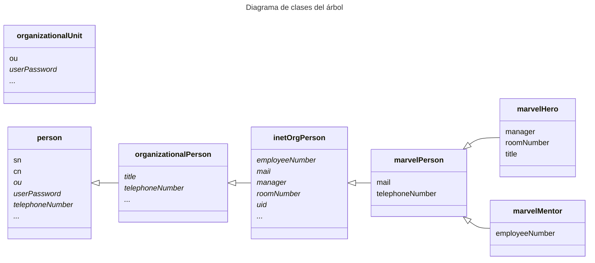
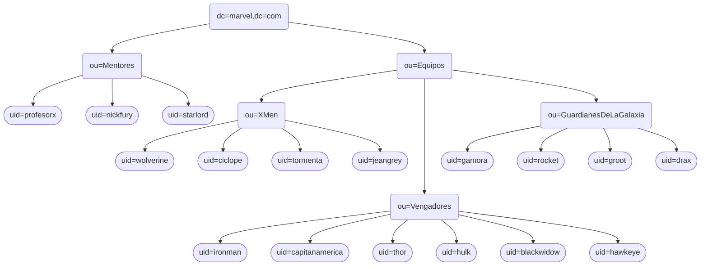

## Administración de Redes Linux

# Entregable 6: LDAP II

<!-- markdownlint-disable MD053 -->
[![CC BY-SA 4.0][shield-cc-by-sa]][cc-by-sa]
[![GITT][shield-gitt]][gitt]
[![Administración de Redes Linux][shield-lna]][lna]

## Introducción

Este documento contiene el registro del desarrollo de la actividad, incluyendo
las instrucciones principales, las decisiones, y los resultados.

## Ejercicio 1: creación del árbol

### Definición de clases

Aunque no se especifica en el enunciado, para profundizar en el ejercicio se
han creado nuevas clases para los héroes y mentores de Marvel. Las nuevas
clases se han creado bajo el OID [`2.999`](https://oidref.com/2.999),
concretamente bajo el `2.999.0493990` para evitar posibles conflictos con otros
OIDs, ya que se ha considerado que este ejercicio se puede clasificar como
ejemplo de uso de OIDs.

Se han declarado como obligatorios los atributos pre-definidos que corresponden
a los datos especificados en las instrucciones. En cuanto a los datos que no
corresponden claramente a un único atributo, se ha usado el que parecía más
apropiado:

* Para el número de teléfono se ha usado `telephoneNumber` (no `mobile`).
* Para el mentor se ha usado `manager`.
* Para el nombre real/completo se ha usado `cn`

El siguiente diagrama ilustra las nuevas clases y sus atributos, así como las
clases de las que heredan.

> **Nota**: Los atributos en cursiva son opcionales. Los puntos suspensivos
> indican que la clase incluye más atributos opcionales, omitidos en el
> diagrama.



Esta extensión clases se ha definido mediante ficheros `.ldif` en el directorio
`./schema/` bajo la entidad `cn=marvel,cn=schema,cn=config`, con un fichero
para definir la entidad (`marvel.ldif`) más un fichero de cambios de tipo `add`
por cada clase.

Para crear la entidad se ha utilizado el comando `ldapadd`:

```sh
sudo ldapadd -WY EXTERNAL -H ldapi:/// -f ./schema/marvel.ldif
```

Para añadir cada clase se ha utilizado el comando `ldapmodify`:

```sh
sudo ldapmodify -WY EXTERNAL -H ldapi:/// -f ./schema/marvelPerson.ldif
sudo ldapmodify -WY EXTERNAL -H ldapi:/// -f ./schema/marvelHero.ldif
sudo ldapmodify -WY EXTERNAL -H ldapi:/// -f ./schema/marvelMentor.ldif
```

### Definición de entradas en el árbol

Usando un solo fichero, [`entries/base.ldif`](entries/base.ldif), se ha creado
el siguiente árbol LDAP:



#### Unidades organizativas

Las unidades organizativas (en rectángulos redondeados) se han definido usando
la clase `organizationalUnit`, que hereda de `top` implícitamente. A
continuación se muestra un ejemplo de definición de una unidad organizativa:

```ldif
dn: ou=Mentores,dc=marvel,dc=com
objectClass: organizationalUnit
ou: Mentores
```

#### Héroes y mentores

Para usar las clases personalizadas en las entradas correspondientes a personas
(en estadios/discorectángulos) se ha especificado la clase relevante como
`objectClass`. Se ha incluido explícitamente la clase `inetOrgPerson` para
mayor claridad, aunque no sea técnicamente necesaria.

El fichero `entries/base.ldif` está codificado en UTF-8. Las tildes y
caracteres no-ASCII en los campos se han dejado tal cual, y son codificados
automáticamente por `ldapadd`.

A continuación se muestra un ejemplo de definición de un héroe:

```ldif
dn: uid=rocket,ou=GuardianesDeLaGalaxia,ou=Equipos,dc=marvel,dc=com
objectClass: inetOrgPerson
objectClass: marvelHero
uid: rocket
cn: Rocket Raccoon
sn: Raccoon
mail: rocket@guardianes.marvel.com
telephoneNumber: +1-555-89P13
manager: uid=starlord,ou=Mentores,dc=marvel,dc=com
roomNumber: 302
title: Guardián del Cuadrante Keystone
```

El siguiente es un ejemplo de definición de un mentor:

```ldif
dn: uid=starlord,ou=Mentores,dc=marvel,dc=com
objectClass: inetOrgPerson
objectClass: marvelMentor
uid: starlord
cn: Peter Quill
sn: Quill
mail: starlord@mentores.marvel.com
telephoneNumber: +1-555-1976
employeeNumber: 0003
```

## Ejercicio 2: control de acceso

### Definición de la política de acceso

El control de acceso en LDAP sigue un orden de comprobación muy estricto.
Siguiendo el orden de las entradas en la configuración:

* Se selecciona la primera entrada en la que coincida el `<what>` con el
  atributo que se intenta acceder
* Se selecciona la primera entrada en la que coincida el `<who>` con el
  usuario que intenta acceder

Ya que esto no permite *fallbacks*, se ha creado una tabla con todas las
combinaciones de acceso y usuarios. Cada fila corresponde a un `<what>`,
mientras que cada columna correspone a un `who`. Ha de tenerse en cuenta que
el acceso para el administrador está implícito, y no es necesario incluirlo en
la configuración, aunque se hará.

La tabla está ordenada verticalmente con prioridad descendente, que en este
caso coincide con el orden de las entradas en la configuración. Al no haber
solapamiento entre distintas filas (excepto la última), un cambio de orden no
afectaría la funcionalidad.

El orden horizontal no coincide con el de la configuración, sino que se ha
decidido de forma que la información sea más clara y fácil de entender. Las
entradas con '-' indican que no se ha definido acceso, pero no indica que se
le niegue explícitamente. Si hubiera otra columna que aplicara al usuario,
se aplicaría la regla de la columna correspondiente. Si ninguna columna
le concediera acceso, se le denegaría.

<!-- markdownlint-capture -->
<!-- markdownlint-disable MD013 -->
| What \ Who                          | admin | self | anon | Mentores | Prof. X | Nick Fury | Starlord | Héroes | Héroes del equipo | Héroes mentorizados   |
| ----------                          | ----- | ---- | ---- | -------- | ------- | --------- | -------- | ------ | ----------------- | --------------------- |
| `userPassword`                      | W     | W    | Auth | -        | -       | -         | -        | -      | -                 | -                     |
| `Vengadores`: `roomNumber`          | W     | R    | -    | R        | W       | W         | -        | -      | -                 | -                     |
| `Guardianes`: `title`               | W     | R    | -    | R        | W       | -         | W        | -      | -                 | -                     |
| `Mentores`: `mail`                  | W     | R    | -    | R        | W       | -         | -        | R      | -                 | -                     |
| `Héroes`: `mail`, `telephoneNumber` | W     | R    | -    | R        | W       | -         | -        | R      | -                 | -                     |
| `Héroes`: `cn`                      | W     | R    | -    | R        | W       | -         | -        | -      | R                 | -                     |
| `Mentores`: `cn`                    | W     | R    | -    | R        | W       | -         | -        | -      | -                 | R                     |
| `*`                                 | W     | R    | -    | R        | W       | -         | -        | -      | -                 | -                     |
<!-- markdownlint-restore -->

### Implementación de la política de acceso

La política de acceso se ha definido en el fichero
[`updates/permissions.ldif`](updates/permissions.ldif), que contiene las
instrucciones para actualizar la configuración de acceso.

Se ha seguido la sintaxis de configuración de acceso descrita en el manual de
[OpenLDAP v2.5][openldap-v2.5-AC] (versión instalada en la máquina virtual) y
en la página del manual `slapd.access(5)`.

Esta política de acceso se ha aplicado modificando la entrada de configuración
`olcDatabase={1}mdb,cn=config` mediante el comando `ldapmodify`. El archivo
`permissions.ldif` contiene las instrucciones para modificar la configuración,
con `changetype: modify` y `replace: olcAccess` para asegurar que los permisos
en la configuración coinciden exactamente con los descritos en el archivo. Las
entradas de control de acceso se han añadido como adiciones al atributo
`olcAccess`, reemplazando a todas las anteriores y preservando el orden
necesario.

Para traducir la tabla en entradas de configuración de acceso, primero se ha
definido la regla menos específica. A continuación se han añadido las reglas
más específicas, incluyendo las especificaciones de la regla genérica cuando la
estas se solapan.

### Desafíos notables

#### Acceso de `entry`

Aunque un usuario tenga acceso a un atributo, puede no tener acceso al
pseudoatributo `entry` del objeto, por lo que será incapaz de acceder al
atributo en cuestión. Para ello, se ha añadido una regla para permitir el
acceso a este pseudoatributo en todas las entradas de clase `marvelPerson`
desde los usuarios de clase `marvelHero` y `marvelMentor`. Se ha decidido así
para seguir el principio de menor privilegio, y no se han juntado los `by`
para hacerlo más claro y editable.

#### Acceso de un héroe a su equipo

Para permitir el entre héroes del mismo equipo se ha usado el selector de
*what* `to dn.regex="ou=[^,]+,ou=Equipos,dc=marvel,dc=com$"` junto con el
selector de *who* `by dn.subtree,expand="$0"`, donde `$0` se expande a la parte
del DN de la entrada a la que se está intentando acceder que coincida con la
expresión regular. La expresión regular recoge el equipo al que pertenece la
entrada a la que se quiere acceder, mientras que el selector de *who* permite
el acceso a los héroes del mismo equipo.

#### Acceso de un héroe a su mentor

Para permitir el acceso de los héroes a los mentores especificados en su campo
`manager`, se ha utilizado el selector `by set="user/manager & this"`, donde
`this` se refiere al mentor al que se intenta acceder, y `user/manager` permite
la comparación de la entrada accedida con el campo `manager` del usuario que
está intentando acceder

## Ejercicio 3: Comprobaciones

Las comprobaciones más relevantes son las de acceso. Los tests se han
desarrollado como scripts de Bash y se han usado continuamente siguiendo el
enfoque de *test-driven development* (TDD) y de desarrollo incremental.

Estos tests se encuentran en el directorio [`tests`](tests), y el principal
ejecutable es [`tests/test-permissions.sh`](tests/test-permissions.sh). Este
script ejecuta todos los tests definidos, dando información sobre el resultado
de cada uno.

### Autenticación y contraseñas

Los tests de permisos dependen de la autenticación como varios usuarios. Para
obtener las contraseñas de forma automática, el script busca un fichero cuyo
nombre coincida con el usuario que se está autenticando en el directorio
especificado por la opción `-p` o `--passwords` del script (`./passwords` por
defecto). Este fichero debe contener únicamente la contraseña del usuario,
**sin nueva línea adicional al final**[^1]. Los ficheros de contraseñas
requeridos para los tests, a excepción del del administrador, se han incluido
en el directorio [`tests/passwords`](tests/passwords).

Para evitar inconsistencias, se ha creado un script de Bash
[`tests/set-passwords.sh`](tests/set-passwords.sh) que establece las
contraseñas de los usuarios si encuentra un fichero con su nombre en el
directorio definido por la opción `-p` o `--passwords` (`./passwords` por
defecto). Este script depende de la existencia del directorio y de un fichero
con la contraseña del usuario `cn=admin,dc=marvel,dc=com`, que se usa para
autenticarse como administrador y poder cambiar las contraseñas con permisos
elevados. **Este archivo no se incluye en el repositorio**

[^1]: Para crear un archivo sin saltos de línea al final, se pueden usar
    comandos como `echo -n` o `printf`, o bien usar un editor de texto que
    permita guardar el archivo sin saltos de línea. En Vim, esto se puede
    conseguir usando `:set nofixeol | set noeol`.

[shield-cc-by-sa]: https://img.shields.io/badge/License-CC%20BY--SA%204.0-lightgrey.svg
[shield-gitt]:     https://img.shields.io/badge/Degree-Telecommunication_Technologies_Engineering_|_UC3M-eee
[shield-lna]:       https://img.shields.io/badge/Course-Linux_Networks_Administration-eee

[cc-by-sa]: https://creativecommons.org/licenses/by-sa/4.0/
[gitt]:     https://uc3m.es/bachelor-degree/telecommunication
[lna]:       https://aplicaciones.uc3m.es/cpa/generaFicha?est=252&plan=445&asig=18467&idioma=2

[openldap-v2.5-AC]: https://www.openldap.org/doc/admin25/access-control.html
