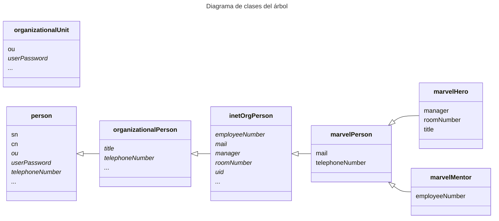

## Administración de Redes Linux

# Entregable 6: LDAP II

<!-- markdownlint-disable MD053 -->
[![CC BY-SA 4.0][shield-cc-by-sa]][cc-by-sa]
[![GITT][shield-gitt]][gitt]
[![Administración de Redes Linux][shield-lna]][lna]

## Introducción

Este documento contiene el registro del desarrollo de la actividad, incluyendo
las instrucciones principales, las decisiones, y los resultados.

## Ejercicio 1: creación del árbol

### Definición de clases

Aunque no se especifica en el enunciado, para profundizar en el ejercicio se
han creado nuevas clases para los héroes y mentores de Marvel. Las nuevas
clases se han creado bajo el OID [`2.999`](https://oidref.com/2.999),
concretamente bajo el `2.999.0493990` para evitar posibles conflictos con otros
OIDs, ya que se ha considerado que este ejercicio se puede clasificar como
ejemplo de uso de OIDs.

Se han declarado como obligatorios los atributos pre-definidos que corresponden
a los datos especificados en las instrucciones. En cuanto a los datos que no
corresponden claramente a un único atributo, se ha usado el que parecía más
apropiado:

* Para el número de teléfono se ha usado `telephoneNumber` (no `mobile`).
* Para el mentor se ha usado `manager`.
* Para el nombre real/completo se ha usado `cn`

El siguiente diagrama ilustra las nuevas clases y sus atributos, así como las
clases de las que heredan.

> **Nota**: Los atributos en cursiva son opcionales. Los puntos suspensivos
> indican que la clase incluye más atributos opcionales, omitidos en el
> diagrama.



Esta extensión clases se ha definido mediante ficheros `.ldif` en el directorio
`./schema/` bajo la entidad `cn=marvel,cn=schema,cn=config`, con un fichero
para definir la entidad (`marvel.ldif`) más un fichero de cambios de tipo `add`
por cada clase.

Para crear la entidad se ha utilizado el comando `ldapadd`:

```sh
sudo ldapadd -WY EXTERNAL -H ldapi:/// -f ./schema/marvel.ldif
```

Para añadir cada clase se ha utilizado el comando `ldapmodify`:

```sh
sudo ldapmodify -WY EXTERNAL -H ldapi:/// -f ./schema/marvelPerson.ldif
sudo ldapmodify -WY EXTERNAL -H ldapi:/// -f ./schema/marvelHero.ldif
sudo ldapmodify -WY EXTERNAL -H ldapi:/// -f ./schema/marvelMentor.ldif
```

### Definición de entradas en el árbol

Usando un solo fichero, [`entries/base.ldif`](entries/base.ldif), se ha creado
el siguiente árbol LDAP:


[shield-cc-by-sa]: https://img.shields.io/badge/License-CC%20BY--SA%204.0-lightgrey.svg
[shield-gitt]:     https://img.shields.io/badge/Degree-Telecommunication_Technologies_Engineering_|_UC3M-eee
[shield-lna]:       https://img.shields.io/badge/Course-Linux_Networks_Administration-eee

[cc-by-sa]: https://creativecommons.org/licenses/by-sa/4.0/
[gitt]:     https://uc3m.es/bachelor-degree/telecommunication
[lna]:       https://aplicaciones.uc3m.es/cpa/generaFicha?est=252&plan=445&asig=18467&idioma=2
